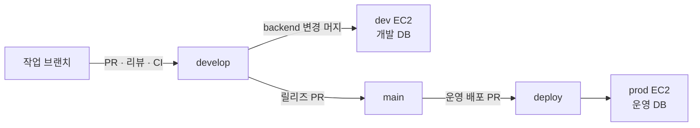

<div align="center">
  

  # sssOK

  **쏙** — 링크 하나로 여는 단발성 이미지·영상 공유 공간
</div>

앱 설치, 번호 교환, 계정 생성 없이 링크 하나로 모여 사진과 영상을 나눠 갖고, 각자의 목적을 이루면 자연스럽게 파하는 가벼운 공유 서비스를 지향합니다.

- **설치 없이 즉시 입장** — 앱 설치, 회원가입 없이 링크만으로 접속
- **단발성 공유 공간** — 모임·행사 등 목적을 위해 잠시 모였다가 끝나면 사라짐
- **간편한 사진/영상 공유** — 번호 교환 없이도 그 자리에서 바로 나눠 가짐

## 프로젝트 구조

```
.
├── backend/    # 백엔드 서버
├── frontend/   # 프론트엔드 앱
└── docs/       # 협업 문서
    ├── collaboration/   # 커밋 컨벤션, 이슈·브랜치·PR 규칙
    ├── deployment/      # 배포 가이드
    ├── troubleshooting/ # 트러블슈팅 기록
    └── requirements/    # PRD, 기능 명세 등 요구사항 문서
```

## 개발 환경

### Frontend

```bash
cd frontend
pnpm install
pnpm start
```

`pnpm start` 는 기본 API 서버에 연결한다. 로컬 백엔드를 연결하려면 `API_BASE_URL`을 지정하고,
서버 없이 화면을 확인하려면 `pnpm start:mock`을 사용한다. 실행 모드와 API 주소는
[백엔드 API 연동](./docs/frontend/BACKEND_INTEGRATION.md)에서 확인한다.

### Backend

백엔드는 Java 21과 Gradle을 사용한다. 로컬 실행에 필요한 프로필·환경 변수와 운영용 Compose 구성은
[배포 가이드](./docs/deployment/DEPLOYMENT.md)를 기준으로 맞춘다. 민감한 값이 든 `.env`는 저장소에
추가하지 않는다.

## 환경과 배포 흐름



- `develop`은 프론트엔드·백엔드가 함께 통합되는 개발 기준선이다.
- 백엔드 변경이 `develop`에 머지되면 dev 서버로 자동 배포된다.
- 운영 반영은 `develop → main → deploy`의 두 번의 PR 승격을 거친다.
- 환경별 서버 설정과 롤백 절차는 [배포 가이드](./docs/deployment/DEPLOYMENT.md), 작업 단위 규칙은
  [브랜치 전략](./docs/collaboration/BRANCH_STRATEGY.md)을 따른다.

## 문서 안내

새로 합류한 개발자는 아래 문서를 먼저 읽어주세요.

| 문서 | 내용 |
| --- | --- |
| [커밋 컨벤션](./docs/collaboration/COMMIT_CONVENTION.md) | 커밋 메시지 타입 및 작성 규칙 |
| [이슈 전략](./docs/collaboration/ISSUE_GUIDE.md) | 라벨, 템플릿, 이슈 작성 규칙 |
| [브랜치 전략](./docs/collaboration/BRANCH_STRATEGY.md) | 브랜치 종류, 네이밍, 워크플로우 |
| [PR 규칙](./docs/collaboration/PR_GUIDE.md) | PR 생성 조건, 리뷰, 머지 조건 |
| [배포 가이드](./docs/deployment/DEPLOYMENT.md) | dev·prod 환경 구성, 배포·롤백, DB 마이그레이션 |
| [트러블슈팅 기록](./docs/troubleshooting/TROUBLESHOOTING.md) | 증상·원인·해결 순서로 정리한 문제 해결 기록 |
| [백엔드 API 연동](./docs/frontend/BACKEND_INTEGRATION.md) | 서버 주소, 실행 모드, 아직 목으로 메운 구멍 |
| [요구사항 문서](./docs/requirements/) | PRD, 기능 명세, 화면 정의서 — [PRD.md](./docs/requirements/PRD.md)부터 시작 |

## 개발 워크플로우 요약

1. [이슈](./docs/collaboration/ISSUE_GUIDE.md) 생성 (담당자·라벨·영역 지정)
2. `develop`에서 [브랜치 전략](./docs/collaboration/BRANCH_STRATEGY.md)에 따라 작업 브랜치 생성
3. [커밋 컨벤션](./docs/collaboration/COMMIT_CONVENTION.md)에 맞게 작업 + 커밋
4. [PR 규칙](./docs/collaboration/PR_GUIDE.md)에 따라 `develop` 대상 PR 생성 → 리뷰 → CI 통과 → 머지
5. 운영 반영이 필요하면 `develop → main → deploy` 순서로 별도 릴리즈 PR을 생성

`hotfix`만 예외적으로 `main`에서 분기해 `main`으로 PR을 보낸 뒤, 같은 변경을 `develop`에도 반영한다.

## 팀원

### Frontend

|  |  |
| :---: | :---: |
| [해니](https://github.com/janghw0126) | [윤돌](https://github.com/yundol777) |

### Backend

|  |  |
| :---: | :---: |
| [마이찬](https://github.com/Uechann) | [현미밥](https://github.com/gahyeonnni) |
