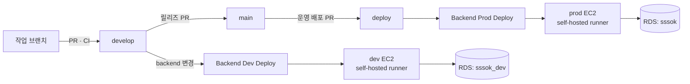

# 배포 가이드

## 전체 구조



- 이미지 빌드는 GitHub-hosted 러너에서, 서버 배포는 **EC2 위에 설치된 self-hosted 러너**에서 실행된다. 배포 잡이 러너 자체이자 배포 대상이므로 SSH/SCP가 필요 없다.
- dev와 prod는 다른 EC2·runner·Compose·`.env`를 사용한다. 현재는 같은 RDS 인스턴스 안에서
  `sssok_dev`와 `sssok` 데이터베이스를 분리한다.
- 이미지 태그는 커밋 SHA를 사용한다. dev 이미지는 `dev-<커밋 SHA>`로, prod 이미지는 `<커밋 SHA>`로
  식별한다. 롤백은 직전 태그로 되돌리는 것으로 끝난다.
- 배포 후 `/health`를 최대 150초간 폴링하고, 실패하면 자동으로 직전 이미지로 롤백한다.

> **왜 self-hosted인가**: GitHub-hosted 러너는 매 실행마다 IP가 바뀌는 임시 VM이라, 보안 그룹에서 특정 IP만 허용하는 정책과 근본적으로 충돌한다. self-hosted 러너를 EC2 안에 두면 배포 스텝이 "밖에서 안으로 접속"하는 게 아니라 "그 자리에서 로컬 실행"이 되므로, 22번 포트를 CI용으로 열어둘 필요가 아예 없어진다.

## 서버 디렉터리 구조

환경별 배포 경로(`DEPLOY_PATH`, 예: `/home/ubuntu/app`) 안에 아래 파일이 놓인다. dev와 prod는
서로 다른 EC2의 서로 다른 경로를 사용한다.

| 파일 | 만드는 주체 | 설명 |
| --- | --- | --- |
| `.env` | **사람이 1회 수동 생성** | DB 접속 정보(RDS), JWT, R2 자격증명, CORS 허용 오리진 |
| `image.env` | CI가 배포마다 덮어씀 | `BACKEND_IMAGE=ghcr.io/...:<sha>` |
| `image.env.prev` | CI가 자동 생성 | 롤백용 직전 태그 |
| `docker-compose.dev.yml` | dev CI가 배포마다 전송 | dev 앱 컨테이너 정의 (`8080` 직접 노출) |
| `docker-compose.prod.yml`, `nginx.conf` | prod CI가 배포마다 전송 | prod 앱·Nginx 컨테이너 정의 (`80`으로 헬스체크) |

## 최초 세팅 (1회만)

### 1. EC2 준비

보안 그룹 인바운드:

| 포트 | 소스 | 용도 |
| --- | --- | --- |
| 22 | 관리자 IP / VPN | 사람이 직접 접속할 때만 (CI는 이 포트를 쓰지 않음) |
| 8080 | 0.0.0.0/0 | 백엔드 (Nginx 붙이기 전 임시) |

CI(GitHub Actions)는 self-hosted 러너를 통해 EC2 내부에서 직접 실행되므로, 22번 포트를 CI용으로 별도 개방할 필요가 없다.

### 2. RDS 준비

DB는 컨테이너가 아니라 RDS(PostgreSQL)를 쓴다.

- RDS는 퍼블릭 서브넷에 두지 않는다.
- RDS 보안 그룹의 인바운드에 EC2 보안 그룹발 5432 포트를 허용한다 (EC2가 있는 VPC/서브넷에서만 접근 가능하도록).
- 마스터 계정과 DB 이름은 `.env`의 `DB_USERNAME`/`DB_PASSWORD`, `DB_URL`의 경로 부분과 일치시킨다.

### 3. Docker 설치

```bash
sudo apt-get update
sudo apt-get install -y ca-certificates curl
sudo install -m 0755 -d /etc/apt/keyrings
sudo curl -fsSL https://download.docker.com/linux/ubuntu/gpg -o /etc/apt/keyrings/docker.asc
sudo chmod a+r /etc/apt/keyrings/docker.asc
echo "deb [arch=$(dpkg --print-architecture) signed-by=/etc/apt/keyrings/docker.asc] https://download.docker.com/linux/ubuntu $(. /etc/os-release && echo $VERSION_CODENAME) stable" | sudo tee /etc/apt/sources.list.d/docker.list > /dev/null
sudo apt-get update
sudo apt-get install -y docker-ce docker-ce-cli containerd.io docker-buildx-plugin docker-compose-plugin
sudo usermod -aG docker $USER
```

`usermod` 이후 **SSH 재접속**해야 sudo 없이 docker를 쓸 수 있다. CI 스크립트가 sudo 없이 실행되므로 이 단계는 필수다.

### 4. 배포 디렉터리와 `.env` 생성

```bash
mkdir -p ~/app && cd ~/app
```

`.env`를 만들고 아래 값을 채운다. 실제 비밀번호·키는 예시나 저장소에 기록하지 않는다.

```bash
cat > .env <<'EOF'
DB_URL=jdbc:postgresql://<rds-endpoint>:5432/sssok
DB_USERNAME=sssok
DB_PASSWORD=여기에_RDS_마스터_비밀번호
JWT_SECRET=여기에_openssl_rand_base64_32_결과
R2_ENDPOINT=https://<account-id>.r2.cloudflarestorage.com
R2_ACCESS_KEY=
R2_SECRET_KEY=
R2_BUCKET=sssok-prod
R2_PUBLIC_BASE_URL=
CORS_ALLOWED_ORIGINS=여기에_프론트_배포_오리진(콤마로_여러_개_가능)
EOF
chmod 600 .env
```

### 5. self-hosted 러너 설치 (EC2 내부)

`Settings → Actions → Runners → New self-hosted runner` 에서 OS/아키텍처(Linux, ARM64)를 선택하면
등록 토큰이 포함된 설치 명령이 나온다. 그 명령을 EC2 에서 그대로 실행한다. 등록 토큰은 1시간 안에 써야 한다.

```bash
mkdir -p ~/actions-runner && cd ~/actions-runner
curl -o actions-runner-linux-arm64.tar.gz -L https://github.com/actions/runner/releases/download/<버전>/actions-runner-linux-arm64-<버전>.tar.gz
tar xzf ./actions-runner-linux-arm64.tar.gz
./config.sh --url https://github.com/woowacourse-teams/2026-sssOK --token <등록_토큰> --labels prod
```

서비스로 등록해서 재부팅 후에도 계속 떠 있게 한다.

```bash
sudo ./svc.sh install
sudo ./svc.sh start
sudo ./svc.sh status   # active (running) 확인
```

러너 실행 계정이 `docker` 그룹에 속해 있는지 확인한다 (안 되어 있으면 `sudo usermod -aG docker ubuntu` 후 `sudo ./svc.sh stop && sudo ./svc.sh start`).

> **보안**: self-hosted 러너는 그 서버에서 임의 코드를 실행할 권한을 가진다. 이 워크플로는 `deploy` 브랜치 push(이미 리뷰된 코드)에만 반응하므로 위험이 낮지만, 이 리포에서 외부 기여자의 fork PR을 받게 되면 `Settings → Actions → General` 에서 fork PR의 워크플로 자동 실행을 반드시 막아야 한다.

### 6. GitHub Secrets 등록

`Settings → Environments → production → Environment secrets`

| 이름 | 예시 |
| --- | --- |
| `DEPLOY_PATH` | `/home/ubuntu/app` |

DB·JWT·R2·CORS 값은 서버 `.env` 에 있으므로 GitHub Secret으로 넣지 않는다. (SSH 기반이 아니므로 `DEPLOY_HOST`/`DEPLOY_USER`/`DEPLOY_SSH_KEY`/`DEPLOY_PORT` 는 더 이상 사용하지 않는다.)

### 7. GHCR 패키지 접근 권한

첫 배포 후 패키지가 생성되면
`https://github.com/orgs/woowacourse-teams/packages` 에서 `2026-sssok/backend` 를 열고
**Package settings → Manage Actions access** 에서 이 저장소에 `Write` 권한이 있는지 확인한다.

## 개발(dev) 서버 세팅 (1회만)

`develop` 브랜치에 `backend/**` 변경이 병합될 때마다 자동 배포되는 백엔드 dev 서버다. 운영과
**물리적으로 다른 EC2**에서 돌고, DB는 운영과 **같은 RDS 인스턴스**를 쓰되 데이터베이스만 분리한다.

### 1. EC2 준비

운영과 다른 EC2 인스턴스를 준비한다. 보안 그룹은 운영과 같은 원칙으로 구성한다 (위 "1. EC2 준비" 표 참고).

### 2. RDS에 dev용 데이터베이스 생성

새 RDS 인스턴스를 만들지 않고, 운영이 쓰는 기존 RDS 안에 데이터베이스만 하나 더 만든다.

```sql
-- 운영 RDS의 마스터 계정으로 접속해서 실행
CREATE DATABASE sssok_dev;
```

- 접속 계정(`DB_USERNAME`)은 운영과 같은 마스터 계정을 그대로 써도 되고, dev 전용 계정을 새로 파도 된다.
- `sssok_dev`는 운영 DB(`sssok`)와 완전히 분리된 스키마 공간이라, dev에서 무슨 짓을 해도 운영 데이터에는
  영향이 없다. Flyway 마이그레이션도 이 DB에 독립적으로 처음부터 적용된다.

### 3. Docker 설치

운영과 동일 (위 "3. Docker 설치" 참고).

### 4. 배포 디렉터리와 `.env` 생성

```bash
mkdir -p ~/app && cd ~/app
```

`.env`를 만들고 아래 값을 채운다. 실제 비밀번호·키는 예시나 저장소에 기록하지 않는다.

```bash
cat > .env <<'EOF'
DB_URL=jdbc:postgresql://<rds-endpoint>:5432/sssok_dev
DB_USERNAME=sssok
DB_PASSWORD=여기에_RDS_마스터_비밀번호
JWT_SECRET=여기에_openssl_rand_base64_32_결과(운영과_다른_값)
R2_ENDPOINT=https://<account-id>.r2.cloudflarestorage.com
R2_ACCESS_KEY=
R2_SECRET_KEY=
R2_BUCKET=sssok-dev
R2_PUBLIC_BASE_URL=
CORS_ALLOWED_ORIGINS=여기에_dev_프론트_오리진(콤마로_여러_개_가능)
EOF
chmod 600 .env
```

`DB_URL`의 데이터베이스 이름(`sssok_dev`)과 `R2_BUCKET`(`sssok-dev`)만 운영과 다르다 —
엔드포인트·계정 등 나머지는 운영과 같은 자원을 공유해도 된다.

### 5. self-hosted 러너 설치 (dev EC2 내부)

운영과 같은 방식으로 설치하되, **`--labels dev`를 추가**해서 운영 러너와 구분한다.

```bash
mkdir -p ~/actions-runner && cd ~/actions-runner
curl -o actions-runner-linux-arm64.tar.gz -L https://github.com/actions/runner/releases/download/<버전>/actions-runner-linux-arm64-<버전>.tar.gz
tar xzf ./actions-runner-linux-arm64.tar.gz
./config.sh --url https://github.com/woowacourse-teams/2026-sssOK --token <등록_토큰> --labels dev
```

서비스 등록은 운영과 동일 (`sudo ./svc.sh install && sudo ./svc.sh start`).

> dev 배포 워크플로(`deploy-dev.yml`)는 `runs-on: [self-hosted, linux, ARM64, dev]`처럼
> `dev` 라벨을 지정해서, 운영 배포 워크플로(`runs-on: [self-hosted, linux, ARM64, prod]`)가 실수로 dev
> 러너에서 돌거나 그 반대가 되는 일이 없게 한다.

### 6. GitHub Secrets 등록

`Settings → Environments → development → Environment secrets`

| 이름 | 예시 |
| --- | --- |
| `DEPLOY_PATH` | `/home/ubuntu/app` |

운영과 마찬가지로 DB·JWT·R2·CORS 값은 dev 서버 `.env`에 있으므로 GitHub Secret으로 넣지 않는다.

## 배포하기

`main`, `develop`, `deploy` 모두 브랜치 보호가 걸려 있어 직접 push가 안 된다 — PR로만 반영한다.

1. `develop`이 릴리즈할 만큼 쌓이고 안정적이면 `develop → main` PR을 만들어 머지한다
   (merge commit, squash 아님 — [BRANCH_STRATEGY.md](../collaboration/BRANCH_STRATEGY.md) 참고)
2. `main`이 안정적이면 `main → deploy` PR을 만들어 머지한다

```bash
gh pr create --base deploy --head main --title "deploy: 운영 배포" --body "main 최신 반영"
```

이 PR이 머지되면 `backend/**` 변경이 있을 때 워크플로가 자동 실행된다. 변경이 없을 때는 Actions 탭에서
`Backend Prod Deploy` → `Run workflow` 로 수동 실행한다.

## 운영 명령어

배포 디렉터리에서 실행한다.

```bash
cd ~/app
export COMPOSE="docker compose --env-file .env --env-file image.env -f docker-compose.prod.yml"
```

| 목적 | 명령 |
| --- | --- |
| 상태 확인 | `$COMPOSE ps` |
| 앱 로그 | `$COMPOSE logs -f app` |
| 재시작 | `$COMPOSE restart app` |
| 전체 내리기 | `$COMPOSE down` |
| 헬스체크 | `curl -i http://localhost/health` |

### 수동 롤백

```bash
cd ~/app
cat image.env.prev > image.env
docker compose --env-file .env --env-file image.env -f docker-compose.prod.yml up -d
```

특정 커밋으로 되돌리려면 `image.env` 의 태그를 직접 바꾼다.

```bash
echo "BACKEND_IMAGE=ghcr.io/woowacourse-teams/2026-sssok/backend:<커밋SHA>" > image.env
```

## DB 마이그레이션

운영은 `ddl-auto: validate` + Flyway 조합이다. **엔티티를 추가·변경하면 마이그레이션 SQL을 반드시 함께 작성해야 한다.** 없으면 `validate` 가 실패해 앱이 뜨지 않는다.

```
backend/src/main/resources/db/migration/
├── V1__create_room.sql
├── V2__create_file.sql
└── V3__add_room_expired_at.sql
```

- 파일명: `V{번호}__{설명}.sql`
- 이미 배포된 마이그레이션 파일은 **절대 수정하지 않는다** (체크섬 불일치로 기동 실패). 수정이 필요하면 새 버전을 추가한다.

## 트러블슈팅

| 증상 | 원인과 조치 |
| --- | --- |
| `permission denied ... docker.sock` | 서버에서 `usermod -aG docker` 후 재접속하지 않음 |
| `denied: installation not allowed to Create organization package` | 워크플로의 `permissions: packages: write` 누락 또는 org 패키지 정책 |
| 헬스체크 실패 후 롤백됨 | `$COMPOSE logs app` 확인. 대부분 `.env` 값 누락 또는 Flyway 마이그레이션 오류 |
| `Schema-validation: missing table` | 엔티티에 대응하는 마이그레이션 SQL 미작성 |
| compose 가 `BACKEND_IMAGE` 를 못 찾음 | `image.env` 부재. 최초 배포 전이거나 경로가 틀림 |
| DB 연결 타임아웃 (`Connection refused`, `timeout`) | RDS 보안 그룹에 EC2 보안 그룹발 5432 인바운드가 없거나, `.env`의 `DB_URL`이 RDS 엔드포인트를 가리키지 않음 |
| `database "sssok-dev" does not exist` | DB 이름의 하이픈/언더스코어가 불일치한 경우다. dev `.env`의 `DB_URL`을 실제 생성한 `sssok_dev`와 일치시킨다. |
| `No space left on device` | EC2 루트 디스크 여유 공간이 부족하다. `df -h`, `docker system df`로 원인을 확인한다. 배포 워크플로는 pull 전과 종료 시 현재·직전 이미지를 제외한 이전 백엔드 이미지를 정리하지만, Docker 외 파일이 원인이거나 정리 후에도 공간이 부족하면 로그를 정리하거나 디스크 용량을 확장한다. |
