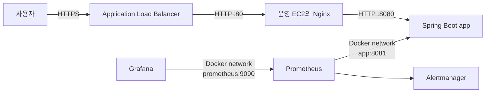
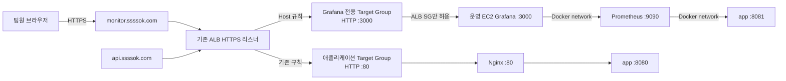
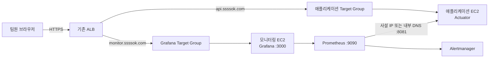

# 운영 모니터링 외부 접근 계획

## 목적

운영 Grafana를 SSH 터널 없이 `https://monitor.ssssok.com`에서 확인할 수 있게 한다.
초기에는 애플리케이션과 모니터링 스택을 현재 운영 EC2에서 함께 실행하되, 외부 접근 경로를
애플리케이션과 분리한다. 이후 자원 경합이나 장애 격리가 필요해지면 공개 URL을 바꾸지 않고
Prometheus·Alertmanager·Grafana를 모니터링 전용 EC2로 이전할 수 있어야 한다.

이 문서는 구현 순서와 운영 기준을 정하는 계획이다. 실제 AWS 리소스 이름·VPC·서브넷·보안 그룹 ID는
적용 전에 운영 계정에서 확인하며 저장소에 시크릿이나 계정별 식별자를 기록하지 않는다. 운영 ALB에는
`project-app`, 운영 EC2에는 `project-public` 보안 그룹이 연결돼 있다는 현재 제약을 전제로 한다.

## 추진 원칙

한 번에 완전한 관측성 플랫폼을 만들지 않는다. 첫 번째 목표는 운영 Grafana를 팀이 브라우저에서 빠르게
열고 현재 수집 중인 지표를 확인할 수 있게 하는 것이다. 이후 호스트·컨테이너·이미지 처리 지표와 알림을
작은 이슈로 나눠 추가한다.

```text
문서로 전체 방향 합의
  → Grafana 외부 접근 MVP
  → 호스트 자원 관측
  → 이미지 처리 관측
  → 경보와 부하 검증
  → 필요할 때 모니터링 인스턴스 분리
```

각 단계는 독립적으로 배포·검증·롤백할 수 있어야 한다. 앞 단계가 운영에서 안정화되기 전에 다음 단계의
수집기를 한꺼번에 추가하지 않는다. 특히 node_exporter, cAdvisor, Loki 같은 구성 요소는 각각 자원을
사용하므로 현재 장애 원인이었던 메모리 여유를 확인하면서 순차 도입한다.

## 빠른 공개 MVP

### 포함 범위

- `monitor.ssssok.com` DNS와 HTTPS 인증서
- 기존 ALB의 Grafana 전용 호스트 규칙
- HTTP `3000`, `/api/health`를 사용하는 Grafana 전용 Target Group
- 기존 `project-app → project-public` 보안 그룹 연결 재사용
- Grafana의 `3000:3000` 게시와 외부 URL 설정
- Grafana 자체 로그인, 익명 접근 및 회원가입 차단
- 기존 `sssOK Backend Overview` 대시보드 접근
- 기존 Prometheus의 애플리케이션 지표 수집 정상 여부 확인

### 제외 범위

다음은 MVP 공개와 함께 구현하지 않고 후속 이슈로 분리한다.

- node_exporter와 cAdvisor 추가
- 이미지 처리 사용자 메트릭 추가
- 대시보드 전면 개편
- 새로운 Alertmanager 규칙
- Loki·Alloy 로그 수집
- Cognito/OIDC와 WAF
- 모니터링 전용 EC2 분리

### 완료 조건

- [ ] 팀원이 SSH·SSM 터널 없이 `https://monitor.ssssok.com`에 접속할 수 있다.
- [ ] 비로그인 사용자는 대시보드를 볼 수 없고 Grafana 로그인이 필요하다.
- [ ] 기존 Backend Overview의 서비스 상태, 요청량, 5xx, p95, JVM Heap, HikariCP 패널이 조회된다.
- [ ] Grafana Target Group이 healthy 상태다.
- [ ] EC2 공인 IP의 `3000`번 포트에는 인터넷에서 직접 접근할 수 없다.
- [ ] Grafana를 중지해도 기존 API와 애플리케이션 Target Group은 정상이다.
- [ ] 문제가 생기면 DNS·ALB 규칙과 Compose 바인딩을 이전 상태로 되돌릴 수 있다.

MVP 완료 뒤 최소 하루 동안 Grafana·Prometheus의 메모리 사용량과 API 상태를 관찰하고 다음 수집기 추가
여부를 결정한다.

## 현재 구조



운영 EC2의 `docker-compose.prod.yml`에서 애플리케이션, Nginx, Prometheus, Alertmanager, Grafana가
같은 Compose 네트워크에서 실행된다.

- 외부 API 트래픽은 ALB가 EC2의 `80`번 포트로 전달하고 Nginx가 `app:8080`으로 프록시한다.
- Actuator 관리 포트 `8081`은 호스트에 게시하지 않고 Prometheus가 `app:8081`로 접근한다.
- Prometheus와 Alertmanager는 호스트에 포트를 게시하지 않는다.
- Grafana만 `127.0.0.1:3000:3000`으로 게시되어 EC2 내부에서만 접근할 수 있다.
- Grafana의 익명 접근과 자체 회원가입은 비활성화되어 있다.

따라서 현재는 EC2 로컬 포트로 연결되는 SSH 또는 SSM 터널 없이는 Grafana를 열 수 없다.

## 1단계 목표 구조: 기존 운영 EC2에서 외부 접근



Grafana와 애플리케이션은 같은 EC2에 남지만 ALB 규칙과 Target Group을 분리한다. 이 경계가 있어야
향후 Grafana Target Group의 대상만 새 인스턴스로 교체할 수 있다.

### 요청 경로

1. 사용자가 `https://monitor.ssssok.com`에 접속한다.
2. Route 53 Alias 레코드가 요청을 기존 ALB로 보낸다.
3. ALB가 ACM 인증서로 TLS를 종료한다.
4. HTTPS 리스너의 `Host = monitor.ssssok.com` 규칙이 요청을 Grafana 전용 Target Group으로 전달한다.
5. Target Group은 운영 EC2의 `3000`번 포트로 요청을 보낸다.
6. Grafana가 자체 로그인으로 사용자를 인증한다.

## 설계 결정

### 별도 서브도메인을 사용한다

경로 기반의 `api.ssssok.com/grafana` 대신 `monitor.ssssok.com`을 사용한다. Grafana의 하위 경로 설정과
리다이렉트 URL 보정을 피할 수 있고, 모니터링 인스턴스를 분리해도 외부 URL을 유지하기 쉽다.

### Grafana 전용 Target Group을 사용한다

애플리케이션 Target Group은 `80`번 포트와 `/health`를 기준으로 동작한다. Grafana는 `3000`번 포트와
`/api/health`를 사용하므로 상태 판정과 장애 범위를 분리한다. Grafana가 비정상이어도 애플리케이션
Target Group과 API 트래픽에는 영향을 주지 않아야 한다.

권장 Target Group 설정은 다음과 같다.

| 항목 | 값 |
| --- | --- |
| 대상 유형 | Instance |
| 프로토콜 | HTTP |
| 포트 | 3000 |
| 헬스체크 프로토콜 | HTTP |
| 헬스체크 경로 | `/api/health` |
| 성공 코드 | `200` |
| 대상 | 현재 운영 EC2 |

### Grafana 자체 인증으로 시작한다

초기에는 Grafana 관리자 계정으로 로그인한다. 익명 접근과 사용자 자체 가입은 계속 비활성화한다.
이 방식은 대시보드 내용을 로그인 뒤에 숨기지만 Grafana HTTP 서버 자체를 인터넷 요청으로부터
격리하지는 않는다. 따라서 다음 조건을 함께 지켜야 한다.

- 사용자는 반드시 ALB의 HTTPS 주소로 접속한다.
- EC2의 `3000`번 포트는 ALB 보안 그룹에서 온 요청만 허용한다.
- 관리자 비밀번호는 길고 고유한 값으로 설정하고 `.env` 외부에 복사하거나 저장소에 기록하지 않는다.
- Grafana 이미지를 정기적으로 업데이트한다.
- 계정 공유가 운영상 문제가 되면 사용자별 계정 또는 Cognito/OIDC를 도입한다.

### 기존 보안 그룹 연결을 재사용한다

Compose에서 Grafana를 ALB가 접근할 수 있는 호스트 포트로 게시해야 하지만, 보안 그룹에서는
`0.0.0.0/0`을 허용하지 않는다. Docker가 게시한 포트는 운영체제 방화벽 정책과 다르게 동작할 수 있으므로
접근 통제의 기준은 EC2 보안 그룹으로 둔다.

현재 `project-public`에는 `project-app`을 원본으로 하는 전체 프로토콜·전체 포트 인바운드 규칙이 있다.
운영 ALB에 연결된 보안 그룹이 실제로 `project-app`과 같은 보안 그룹 ID인지 적용 전에 확인한다. 일치하면
이 규칙으로 ALB에서 EC2의 `3000`번 포트에 접근할 수 있으므로 Grafana 전용 인바운드 규칙을 새로 만들지
않는다. 조직에서 정한 기존 인바운드 규칙도 이번 작업에서 변경하지 않는다.

| 대상 | 포트 | 허용 소스 |
| --- | ---: | --- |
| 운영 EC2 Grafana | 3000 | 기존 `project-public`의 `project-app` 원본 규칙 재사용 |
| 운영 EC2 Nginx | 80 | 기존 보안 그룹 규칙 유지 |
| 운영 EC2 Actuator | 8081 | 외부 인바운드 없음 |

현재 `80`과 `8080`이 인터넷 CIDR에 허용된 것은 이번 Grafana 공개와 별개의 기존 제약이다. 특히
`8080`은 ALB와 Nginx를 우회해 애플리케이션에 접근할 수 있으므로 보안 위험으로 기록한다. 조직 정책상
변경할 수 없다면 이번 작업의 차단 조건으로 삼지는 않되, 별도 보안 개선 과제로 관리한다.

## 변경 계획

### 1. 사전 확인

- [ ] `monitor.ssssok.com`을 관리하는 DNS Hosted Zone을 확인한다.
- [ ] 기존 ALB와 HTTPS `443` 리스너를 확인한다.
- [ ] ALB 보안 그룹과 운영 EC2 보안 그룹을 확인한다.
- [ ] ALB의 `project-app` 보안 그룹 ID가 `project-public` 인바운드 규칙의 원본과 일치하는지 확인한다.
- [ ] 운영 EC2가 ALB가 사용하는 가용 영역과 Target Group에 등록 가능한 네트워크인지 확인한다.
- [ ] ACM 인증서의 SAN에 `monitor.ssssok.com` 또는 `*.ssssok.com`이 포함되는지 확인한다.
- [ ] 현재 Grafana 관리자 계정 정보를 안전한 경로로 확보한다.
- [ ] `3000`번 호스트 포트가 다른 프로세스에서 사용 중이지 않은지 확인한다.

### 2. DNS와 인증서

1. 기존 인증서가 `monitor.ssssok.com`을 포함하지 않으면 해당 이름이 포함된 ACM 인증서를 발급한다.
2. DNS 검증을 완료하고 인증서 상태가 `Issued`인지 확인한다.
3. ALB HTTPS 리스너에 인증서를 추가한다.
4. Route 53에서 `monitor.ssssok.com` A/AAAA Alias 레코드를 기존 ALB로 연결한다.
5. ALB의 HTTP `80` 리스너는 HTTPS로 리다이렉트한다.

인증서가 준비되기 전에 HTTP 주소를 먼저 공개하지 않는다. Grafana 로그인 정보는 HTTPS 연결에서만
전송되어야 한다.

### 3. Grafana 전용 Target Group과 리스너 규칙

1. HTTP `3000` 포트와 `/api/health` 헬스체크를 사용하는 Grafana 전용 Target Group을 생성한다.
2. 현재 운영 EC2를 Target Group에 등록한다.
3. ALB HTTPS 리스너에 `Host = monitor.ssssok.com` 조건을 추가한다.
4. 규칙의 전달 대상을 Grafana 전용 Target Group으로 지정한다.
5. 기존 API 규칙보다 우선순위가 높고 다른 호스트 규칙과 충돌하지 않는지 확인한다.

### 4. 보안 그룹

`project-public`에 이미 존재하는 `project-app` 원본의 전체 트래픽 허용 규칙을 재사용한다. 두 보안 그룹
ID가 일치하면 인바운드 규칙을 추가하거나 수정하지 않는다. Grafana를 위해 공인 IP CIDR이나
`0.0.0.0/0`, `::/0`을 원본으로 하는 `3000`번 규칙은 만들지 않는다.

두 보안 그룹 ID가 일치하지 않으면 임의로 새 규칙을 만들지 않고 인프라 관리자와 연결 관계를 먼저
확인한다. 조직 정책상 정해진 보안 그룹 규칙을 우회하기 위해 EC2 공인 IP나 다른 공개 포트를 사용하지
않는다.

### 5. Compose와 Grafana 설정

`docker-compose.prod.yml`의 Grafana 호스트 바인딩을 ALB가 접근할 수 있도록 변경한다.

```yaml
grafana:
  environment:
    GF_SERVER_ROOT_URL: https://monitor.ssssok.com
    GF_AUTH_ANONYMOUS_ENABLED: "false"
    GF_USERS_ALLOW_SIGN_UP: "false"
  ports:
    - "3000:3000"
```

`GF_SERVER_ROOT_URL`은 Grafana가 로그인과 정적 자원 URL을 올바른 외부 주소로 생성하도록 한다.
Grafana, Prometheus, Alertmanager의 내부 Docker 네트워크 연결은 변경하지 않는다.

이 저장소의 운영 배포는 `deploy` 브랜치 머지로 실행된다. Compose 변경을 실제 운영에 반영할 때는
일반 작업 PR과 릴리스 승격 절차를 따른다. AWS 콘솔 변경과 코드 배포 사이에는 일시적으로 Target Group이
비정상이 될 수 있으므로 다음 순서를 사용한다.

1. DNS와 인증서를 준비한다.
2. Target Group과 리스너 규칙을 만들되 사용자에게 공지하지 않는다.
3. `project-app`에서 `project-public`로 향하는 기존 규칙이 `3000` 접근을 허용하는지 확인한다.
4. Compose 변경을 배포한다.
5. Target Group이 healthy가 된 것을 확인한다.
6. 최종 검증 후 팀에 URL을 공유한다.

## 검증 계획

### 기능 검증

- [ ] `https://monitor.ssssok.com`이 유효한 인증서로 열리는가.
- [ ] 비로그인 사용자는 Grafana 로그인 화면까지만 접근할 수 있는가.
- [ ] 잘못된 계정으로 대시보드에 접근할 수 없는가.
- [ ] 정상 계정으로 `sssOK Backend Overview` 대시보드를 열 수 있는가.
- [ ] 서비스 상태, 요청량, 5xx 비율, p95 응답 시간, JVM Heap, HikariCP 지표가 조회되는가.
- [ ] Grafana의 데이터 소스 점검에서 Prometheus가 정상으로 표시되는가.
- [ ] Grafana 재시작 후에도 프로비저닝된 데이터 소스와 대시보드가 유지되는가.

### 네트워크 검증

- [ ] Grafana Target Group의 대상이 healthy인가.
- [ ] EC2 공인 IP의 `3000`번 포트로 인터넷에서 직접 접근할 수 없는가.
- [ ] ALB의 `project-app`과 `project-public` 인바운드 원본의 보안 그룹 ID가 일치하는가.
- [ ] 인터넷 CIDR을 원본으로 하는 `3000`번 규칙이 추가되지 않았는가.
- [ ] `8081`, `9090`, `9093`이 인터넷에 공개되지 않았는가.
- [ ] `api.ssssok.com`의 기존 API와 헬스체크가 정상인가.

### 장애 격리 검증

1. Grafana 컨테이너만 중지했을 때 Grafana Target Group이 unhealthy가 되는지 확인한다.
2. 같은 동안 `https://api.ssssok.com/health`와 주요 API가 정상인지 확인한다.
3. Grafana를 다시 시작하고 Target Group이 healthy로 복구되는지 확인한다.

운영 검증에서 의도적으로 컨테이너를 중지하는 경우 사용자 영향이 적은 시간에 수행하고 즉시 복구한다.

## 롤백

문제가 발생하면 애플리케이션 경로는 유지한 채 Grafana 공개 경로만 되돌린다.

1. ALB의 `monitor.ssssok.com` 리스너 규칙을 비활성화하거나 삭제한다.
2. Route 53의 `monitor.ssssok.com` Alias 레코드를 제거한다.
3. Compose의 Grafana 포트 바인딩을 `127.0.0.1:3000:3000`으로 되돌린다.
4. Grafana를 재기동하고 Prometheus·Alertmanager와 API가 계속 정상인지 확인한다.

기존 `project-public`·`project-app` 보안 그룹 규칙은 이번 작업에서 만들거나 변경한 것이 아니므로
롤백에서도 수정하지 않는다.

Grafana 볼륨과 Prometheus 데이터 볼륨은 롤백 과정에서 삭제하지 않는다. `docker compose down -v`는
모니터링 이력을 삭제하므로 사용하지 않는다.

## 장애 분석 기반 개선 로드맵

### 확인된 문제와 판단 범위

장애 자료에서는 904MiB 물리 메모리 중 사용 가능 메모리가 117MiB까지 감소했고 Swap 약 1GiB가
사용됐다. Java 프로세스 RSS는 약 480MiB였으며, 컨테이너 제한 없이
`-XX:MaxRAMPercentage=75.0`을 사용해 JVM이 호스트 메모리를 기준으로 Heap을 크게 잡을 수 있었다.
같은 호스트에는 Grafana·Prometheus·Alertmanager·Nginx·Docker daemon·SSM Agent·GitHub Actions
Runner도 함께 실행됐다.

이미지 처리 Executor는 최대 8개 작업과 100개 대기열을 허용했고, 디코딩 시 약 18MiB 이상으로
확장되는 48bit ICC 이미지가 포함됐다. WebP 변환에 영구적으로 실패한 3개 미디어가 `PROCESSING`에
남아 5분마다 최대 50개를 회수하는 배치에 반복 제출됐고, 같은 대상에서 61회 실패가 기록됐다.

이 조건은 다음 흐름과 일치한다.

```text
작은 호스트와 과도한 JVM 상한
  + 이미지 처리 동시성과 디코딩 메모리 증폭
  + 영구 실패 작업의 반복 재처리
  + 모니터링 컨테이너의 상시 메모리
  ↓
물리 메모리 고갈과 Swap 의존
  ↓
JVM·호스트 스케줄링 지연
  ↓
Hikari housekeeper 지연과 로컬 Health check 연속 실패
  ↓
사용자 요청 지연과 서버 접속 불안정
```

반면 OOM Kill, Java deadlock, 디스크 고갈은 확인되지 않았다. 긴 GC 정지와 순간 CPU 포화는 장애
시간대의 연속 지표가 없어 확정하지 않는다. 로드맵은 확인된 메모리·재시도 문제를 먼저 제거하고,
미확정 원인은 관측 데이터를 추가해 다음 장애에서 판별할 수 있게 하는 순서로 진행한다.

### P0. 노출된 비밀정보 교체

공유된 `docker inspect` 자료에 DB 비밀번호, JWT 비밀키, R2 접근 키가 평문으로 포함됐다. 해당 값은
실제 열람 범위와 관계없이 노출된 것으로 간주한다.

- [ ] R2 접근 키를 새로 발급하고 기존 키를 폐기한다.
- [ ] DB 비밀번호를 교체하고 애플리케이션 연결을 검증한다.
- [ ] JWT 비밀키 교체 시 기존 로그인 세션이 무효화되는 영향을 공지하고 새 키로 전환한다.
- [ ] 운영 EC2의 `.env`와 관련 배포 시크릿을 새 값으로 갱신한다.
- [ ] 애플리케이션 재기동 후 DB, 로그인, 업로드·조회 경로를 검증한다.
- [ ] 공유된 장애 자료에서 환경변수와 토큰을 제거한 정제본만 보관한다.
- [ ] 앞으로 `docker inspect` 원본을 공유하지 않는 장애 자료 수집 절차를 문서화한다.

완료 기준은 기존 자격증명이 더 이상 동작하지 않고 새 자격증명으로 주요 기능 검증이 끝난 상태다.

### P1. 즉시 안정화와 재발 부하 차단

코드 구조를 크게 바꾸기 전에 같은 입력이 다시 들어와도 호스트 전체가 느려지지 않게 한다.

#### JVM과 컨테이너 예산

- [ ] 운영 인스턴스의 실제 메모리 용량과 평시 컨테이너·호스트 메모리 기준선을 다시 측정한다.
- [ ] JVM Heap을 호스트 비율이 아닌 명시적 컨테이너 메모리 예산 안에서 결정한다.
- [ ] 애플리케이션 컨테이너에 메모리 제한과 예약값을 두고 JVM Heap 외 Metaspace, 스레드 Stack,
      Direct buffer, JNI 버퍼를 위한 여유를 남긴다.
- [ ] Prometheus·Grafana에도 상한 또는 운영 예산을 정해 애플리케이션 메모리를 잠식하지 않게 한다.
- [ ] 변경값은 추측으로 고정하지 않고 대표 이미지 부하 테스트와 24시간 평시 관측 후 확정한다.

컨테이너 제한만 낮춰 OOM을 앞당기지 않도록 `Heap + JVM 비Heap + 이미지 네이티브 버퍼`의 실제 피크를
함께 측정한다. 인스턴스를 상향했더라도 제한 없는 JVM과 무제한 재시도 문제는 그대로 남으므로 별도로
해결한다.

#### 이미지 처리 동시성

- [ ] 이미지 Executor의 `core-size`, `max-size`, `queue-capacity`를 운영 메모리 예산에 맞춰 축소한다.
- [ ] 초기값은 최대 동시 작업을 2개 이하로 제한하는 보수적인 설정에서 부하 테스트로 조정한다.
- [ ] 썸네일·프리뷰 생성과 ZIP·스토리지 정리 작업이 서로 영향을 주지 않도록 Executor 분리를 검토한다.
- [ ] 큐가 가득 찬 경우 호출 스레드에서 무제한 처리하거나 작업을 유실하지 않도록 거부 정책을 명시한다.

#### 반복 재처리 차단

- [ ] `Incompatible image`처럼 같은 입력에서 재현되는 오류를 영구 실패로 분류한다.
- [ ] 영구 실패 미디어를 `PROCESSING`에 남기지 않고 명시적인 실패 상태와 실패 사유로 전환한다.
- [ ] 일시적 오류에도 최대 시도 횟수와 지수 백오프를 적용한다.
- [ ] 회수 배치가 `다음 시도 시각`, `시도 횟수`, `실패 종류`를 기준으로 대상만 선택하게 한다.
- [ ] 기존 반복 실패 미디어 3개를 격리하거나 실패 처리해 배치 재선택에서 제외한다.

P1 완료 기준은 문제 이미지가 들어와도 같은 미디어가 무제한 재시도되지 않고, 대표 부하 중 Health check
연속 실패와 지속적인 Swap 입출력이 발생하지 않는 상태다.

### P2. 이미지 파이프라인 복원력 개선

- [ ] 48bit ICC 색상 이미지를 포함한 실제 실패 파일을 회귀 테스트 fixture로 추가한다.
- [ ] WebP writer에 전달하기 전에 지원되는 8bit sRGB 형식으로 색상 공간과 비트 깊이를 정규화한다.
- [ ] 픽셀 수, 가로·세로 크기, 프레임 수와 디코딩 예상 메모리를 처리 전에 검증한다.
- [ ] 허용 한도를 넘는 이미지는 디코딩을 시작하기 전에 사용자에게 설명 가능한 오류로 거절한다.
- [ ] 원본, 방향 보정본, 썸네일, 프리뷰 버퍼의 생존 구간을 줄이고 사용 후 참조를 즉시 해제한다.
- [ ] 네이티브 WebP 인코더 실패가 JVM 전체 안정성에 미치는 영향을 테스트한다.
- [ ] 50장 연속 업로드와 고비트 이미지 혼합 업로드 시나리오로 최대 RSS와 처리 시간을 측정한다.

P2 완료 기준은 기존 실패 이미지가 정상 변환되거나 재시도하지 않는 명시적 실패로 종료되고, 대량 업로드
테스트의 최대 메모리가 정한 컨테이너 예산 안에 머무는 상태다.

### P3. 원인을 판별할 수 있는 관측성 보강

현재 대시보드는 HTTP, JVM Heap, HikariCP 지표를 제공하지만 호스트 메모리와 이미지 작업 상태가
부족하다. Grafana 외부 접근을 연 뒤 다음 지표를 함께 수집한다.

| 영역 | 필요한 지표 | 초기 경보 기준 |
| --- | --- | --- |
| 호스트 | available 메모리, Swap 사용량, swap-in/out, load | available 20% 미만 지속 경고, 10% 미만 긴급 |
| 컨테이너 | 컨테이너별 RSS·제한 대비 사용률, 재시작, OOM | 제한 대비 80% 이상 지속 또는 OOM 즉시 |
| JVM | Heap·non-Heap, GC 횟수·정지 시간, 스레드 수 | 긴 GC 정지 또는 비정상 증가 추세 |
| 이미지 Executor | active, pool size, queue size, rejected count | 큐 70% 이상 지속 또는 reject 발생 |
| 이미지 처리 | 입력 픽셀·비트 깊이, 처리 시간, 성공·실패, 재시도 | 영구 실패 반복 또는 처리시간 급증 |
| 애플리케이션 | readiness, p95, 5xx, Hikari active·pending | 기존 알림과 자원 경보를 함께 상관 분석 |

Swap 사용량은 압박이 해소된 뒤에도 남을 수 있으므로 사용량만으로 현재 장애라고 판단하지 않는다.
지속적인 `swap-in/out`, available 메모리, 응답 시간과 함께 본다. 호스트·컨테이너 지표는
node_exporter와 cAdvisor 또는 동등한 수집 방식을 비교해 선택한다.

- [ ] 장애 발생 시각 전후 지표가 최소 보존 기간 동안 남는지 확인한다.
- [ ] GC 로그를 활성화하고 크기·개수 제한이 있는 로그 로테이션을 적용한다.
- [ ] Hikari thread starvation 경고, Health check 실패, Swap 입출력을 한 타임라인에서 조회한다.
- [ ] 알림이 실제 복구까지 Discord에서 firing/resolved로 이어지는지 시험한다.
- [ ] 대시보드와 알림 임계값은 정상 트래픽 기준선을 수집한 뒤 조정한다.

### P4. 부하 검증과 용량 기준 확정

변경 전후를 같은 조건으로 비교할 수 있는 재현 시나리오를 만든다.

1. 일반 이미지 50장 연속 업로드
2. 48bit ICC 이미지와 일반 이미지 혼합 업로드
3. 동일한 영구 실패 입력 반복 제출
4. 업로드 중 일반 API 읽기·쓰기 요청 동시 실행
5. Prometheus 수집과 Grafana 대시보드 자동 새로고침 동시 실행

각 시나리오에서 최대 호스트 available 메모리, 컨테이너 RSS, JVM Heap·non-Heap, GC 정지, Executor
큐, p95 응답 시간, Health check 실패와 Swap 입출력을 기록한다. 최소한 다음 조건을 만족해야 한다.

- Health check 연속 실패가 없다.
- 영구 실패 입력의 처리 횟수가 최대 시도 횟수를 넘지 않는다.
- 이미지 처리 큐가 작업 종료 후 정상적으로 감소한다.
- 컨테이너가 설정된 메모리 예산을 넘지 않는다.
- 부하 종료 후 응답 시간과 메모리가 기준선으로 회복한다.

### P5. 모니터링 전용 EC2 분리

P1~P4로 애플리케이션 자체의 메모리 증폭과 반복 재시도를 먼저 통제한다. 모니터링을 분리하는 것만으로
이미지 처리 문제를 해결했다고 판단하지 않는다. 이후에도 자원 경합 또는 장애 동반 소실 문제가 남으면
아래 2단계 구조로 이전한다.

분리 우선순위를 높이는 정량 신호는 다음과 같다.

- 정상 트래픽에서도 애플리케이션과 모니터링 합계가 호스트 메모리 예산의 70% 이상을 지속 사용한다.
- Grafana 쿼리나 Prometheus compaction 시 애플리케이션 p95 또는 available 메모리가 반복 악화된다.
- Prometheus 저장 공간 증가로 애플리케이션 디스크 운영 여유를 침해한다.
- 애플리케이션 EC2 장애 중에도 과거 지표를 조회해야 한다는 운영 요구가 생긴다.

### 실행 순서 요약

| 우선순위 | 목표 | 완료 증거 |
| --- | --- | --- |
| P0 | 노출 자격증명 폐기 | 기존 키 사용 불가, 새 키로 주요 기능 정상 |
| P1 | 즉시 재발 방지 | 무제한 재시도 제거, 제한된 동시성에서 Health 정상 |
| P2 | 이미지 처리 복원력 | 실패 fixture 통과 또는 명시적 영구 실패 종료 |
| P3 | 장애 원인 관측 | 호스트·컨테이너·GC·Executor 지표와 알림 확인 |
| P4 | 용량 검증 | 대표 부하 테스트가 메모리 예산과 응답 기준 충족 |
| P5 | 장애 격리 | 모니터링 EC2 이전 후 URL 유지 및 수집 정상 |

## 후속 이슈 분할안

계획 문서가 합의되면 아래 순서로 이슈를 하나씩 생성한다. 각 이슈는 하나의 관측 영역 또는 하나의
안정화 관심사만 다루고, 앞 이슈의 운영 검증 결과를 다음 이슈의 입력으로 사용한다.

| 순서 | 이슈 제목 후보 | 핵심 산출물 | 선행 조건 |
| ---: | --- | --- | --- |
| 1 | `[BE] 운영 Grafana 외부 접근 구성` | DNS·ACM·ALB Target Group·Compose 설정 | 이 계획 승인 |
| 2 | `[BE] 운영 호스트 자원 메트릭 수집` | node_exporter, Prometheus scrape, 호스트 대시보드 | Grafana MVP 안정화 |
| 3 | `[BE] 이미지 처리 Executor 메트릭 추가` | active·queue·reject Micrometer 지표 | 메트릭 이름 합의 |
| 4 | `[BE] 이미지 처리 결과와 재시도 메트릭 추가` | 성공·실패·영구 실패·재시도 지표 | 실패 분류 기준 합의 |
| 5 | `[BE] 영구 실패 이미지 반복 재처리 차단` | 실패 상태, 최대 시도, 백오프, 회귀 테스트 | 기존 실패 데이터 확인 |
| 6 | `[BE] 운영 자원 및 이미지 처리 대시보드 구성` | 자원·이미지·상관분석 대시보드 | 2~4번 지표 수집 |
| 7 | `[BE] 운영 자원 고갈 알림 구성` | 메모리·Swap·Executor·재시도 알림 | 정상 기준선 확보 |
| 8 | `[BE] JVM과 컨테이너 메모리 예산 적용` | 컨테이너 제한과 JVM 상한 | 부하 측정 결과 확보 |
| 9 | `[BE] 고비트 이미지 처리 복원력 개선` | 48bit ICC 정규화·입력 제한·테스트 | 실패 fixture 확보 |
| 10 | `[BE] 이미지 대량 처리 부하 검증` | 50장 혼합 업로드 결과와 용량 기준 | 안정화 변경 완료 |
| 11 | `[BE] 컨테이너 자원 메트릭 수집 검토` | cAdvisor 도입 여부 및 필요 시 대시보드 | node_exporter 운영 결과 |
| 12 | `[BE] 모니터링 전용 인스턴스 분리` | Prometheus·Grafana 이전과 내부 수집 경로 | 분리 조건 충족 |

첫 구현 이슈는 외부 접근만 다룬다. 호스트 지표 수집은 그 다음 이슈로 분리해, Grafana 공개 과정에서
문제가 생겼을 때 네트워크·인증 문제와 새 수집기 문제를 동시에 추적하지 않게 한다.

각 후속 이슈는 다음 공통 항목을 포함한다.

- 변경 전 기준값과 해결하려는 관측 공백
- 추가되는 컨테이너·메트릭·대시보드의 자원 비용
- 정상 동작과 실패 상황의 검증 방법
- 운영 반영 후 관찰 기간과 성공 기준
- 기능을 제거하거나 이전 설정으로 되돌리는 롤백 절차

## 2단계 목표 구조: 모니터링 전용 EC2 분리

### 분리 검토 기준

다음 중 하나 이상이 반복되면 전용 인스턴스 분리를 검토한다.

- Prometheus 쿼리나 Grafana 렌더링이 애플리케이션 CPU·메모리에 영향을 준다.
- Prometheus TSDB와 컨테이너 로그가 애플리케이션 디스크 여유 공간을 압박한다.
- 애플리케이션 EC2 장애 시 장애 원인을 확인할 모니터링 화면까지 함께 사라지는 문제가 중요해진다.
- 메트릭 보존 기간, 수집 대상 또는 팀 사용자가 늘어 운영 부하가 커진다.
- 모니터링 스택을 애플리케이션 배포·재시작 주기와 독립적으로 관리해야 한다.

### 분리 후 구조



외부 URL과 ALB 리스너 규칙은 유지하고 Grafana Target Group의 등록 대상을 모니터링 EC2로 바꾼다.
가장 큰 내부 변화는 Prometheus가 더 이상 Docker 네트워크의 `app:8081`을 사용할 수 없다는 점이다.

### 분리 전 준비

- 모니터링 EC2는 애플리케이션 EC2와 통신 가능한 VPC·서브넷에 둔다.
- 모니터링 EC2 전용 보안 그룹을 만든다.
- 애플리케이션 EC2의 `8081` 인바운드는 모니터링 EC2 보안 그룹에서만 허용한다.
- `8081`은 ALB나 인터넷에서 접근할 수 없게 유지한다.
- Prometheus 대상은 애플리케이션 EC2의 사설 IP 또는 안정적인 내부 DNS 이름을 사용한다.
- EC2 교체 시 주소가 변할 가능성이 있으면 Route 53 Private Hosted Zone이나 서비스 디스커버리를 검토한다.

Prometheus 설정 예시는 다음과 같다.

```yaml
scrape_configs:
  - job_name: sssok-backend
    metrics_path: /actuator/prometheus
    static_configs:
      - targets:
          - sssok-app.internal:8081
```

이를 위해 애플리케이션 컨테이너의 `8081`을 호스트 또는 전용 내부 프록시에 게시해야 한다. 게시 시에도
보안 그룹 소스는 모니터링 EC2 보안 그룹으로 제한한다.

### 데이터 이전

이전 대상은 최소한 다음 볼륨이다.

- `prometheus-data`: 보존 중인 시계열 데이터
- `alertmanager-data`: 알림 상태
- `grafana-data`: 사용자·세션·UI에서 변경한 상태

저장소에 프로비저닝된 대시보드와 데이터 소스는 파일로 다시 만들 수 있지만, 볼륨에만 존재하는 상태는
별도로 이전해야 한다. 일관된 복사를 위해 기존 컨테이너의 쓰기를 멈춘 상태에서 Docker 볼륨을 백업하고
새 인스턴스에서 복원한다. 데이터 이력 보존이 필요하지 않으면 새 볼륨으로 시작한다는 결정을 먼저
기록한다.

### 전환 순서

1. 새 모니터링 EC2에서 Prometheus·Alertmanager·Grafana를 기동한다.
2. Prometheus가 애플리케이션의 `/actuator/prometheus`를 사설망으로 수집하는지 확인한다.
3. 새 Grafana에서 기존 대시보드와 최근 메트릭을 확인한다.
4. Grafana Target Group에 새 EC2를 추가하고 healthy가 될 때까지 기다린다.
5. 두 대상이 함께 등록된 짧은 전환 구간을 거친다.
6. 기존 운영 EC2를 Target Group에서 제거한다.
7. `monitor.ssssok.com`의 로그인과 대시보드를 다시 검증한다.
8. 안정화 기간 후 운영 EC2의 모니터링 컨테이너와 불필요한 `3000`·`8081` 규칙을 제거한다.

Grafana 로컬 SQLite 데이터베이스를 두 인스턴스가 동시에 공유하지 않는다. 전환 중 두 Grafana가 각자
별도 볼륨을 사용한다면 사용자 설정 변경을 잠시 금지하거나 프로비저닝된 설정만 사용한다.

### 분리 롤백

새 모니터링 EC2에서 문제가 발생하면 Grafana Target Group에 기존 운영 EC2를 다시 등록한다.
기존 모니터링 컨테이너와 볼륨은 안정화가 끝날 때까지 삭제하지 않는다. Prometheus 수집 경로와 보안 그룹도
롤백 기간 동안 기존·신규 경로를 복구할 수 있게 유지한다.

## 후속 개선 조건

### Cognito 또는 OIDC

다음 상황에서는 Grafana 비밀번호만 사용하는 대신 ALB의 Cognito/OIDC 인증을 추가한다.

- 여러 사람이 하나의 관리자 계정을 공유하게 된다.
- 프로젝트를 떠난 사용자의 접근을 즉시 회수해야 한다.
- 사용자별 접근 이력과 계정 수명 주기 관리가 필요하다.
- Grafana 편집자·조회자 권한을 팀 계정 체계와 연결해야 한다.

ALB 인증을 추가하더라도 Grafana Target Group과 `monitor.ssssok.com` 구조는 유지할 수 있다.

### WAF와 요청 속도 제한

로그인 무차별 대입이나 스캐닝 요청이 관찰되거나 다른 서비스에서 이미 AWS WAF를 사용한다면
`/login`을 포함한 Grafana 요청에 속도 기반 규칙을 적용한다. 차단 기준은 정상적인 대시보드 자동 갱신을
방해하지 않도록 실제 요청량을 확인한 뒤 정한다.

### Grafana Cloud

다음 요구가 생기면 자체 운영 인스턴스 분리와 함께 Grafana Cloud를 비교한다.

- 애플리케이션·모니터링 EC2가 모두 장애여도 과거 지표를 조회해야 한다.
- 장기 보존과 고가용성을 직접 운영하기 어렵다.
- Loki 로그, Tempo 트레이싱까지 하나의 관리형 플랫폼에 통합하려 한다.
- Prometheus 저장소 운영 비용이 관리형 서비스 비용보다 커진다.

Grafana Cloud를 선택하면 운영 Prometheus의 `remote_write`를 사용하고 API 토큰은 서버 시크릿으로
관리한다. 메트릭의 외부 전송 범위와 예상 활성 시계열 수를 먼저 검토한다.

## 운영 체크리스트

### 최초 공개 완료 조건

- [ ] `monitor.ssssok.com` DNS와 ACM 인증서가 정상이다.
- [ ] Grafana 전용 Target Group과 ALB 호스트 규칙이 분리되어 있다.
- [ ] EC2 `3000`번 포트는 ALB 보안 그룹에서만 접근할 수 있다.
- [ ] Grafana 익명 접근과 사용자 가입이 비활성화되어 있다.
- [ ] 로그인 후 모든 기본 대시보드 패널에서 데이터가 조회된다.
- [ ] Grafana 장애가 API 가용성에 영향을 주지 않는다.
- [ ] 롤백 절차를 담당자가 확인했다.

### 정기 점검

- [ ] Grafana·Prometheus·Alertmanager 이미지 업데이트 필요 여부를 확인한다.
- [ ] Grafana 관리자와 사용자 계정을 점검하고 불필요한 계정을 제거한다.
- [ ] Target Group 헬스와 인증서 만료 상태를 확인한다.
- [ ] Prometheus 디스크 사용량과 15일 보존 설정의 적정성을 확인한다.
- [ ] 외부 접근 로그에서 비정상적인 로그인 시도나 스캔 증가 여부를 확인한다.
- [ ] 모니터링 인스턴스 분리 기준에 해당하는 자원 경합이 있는지 확인한다.
