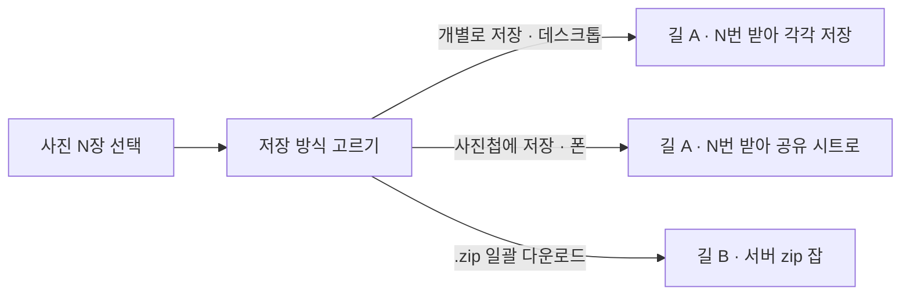
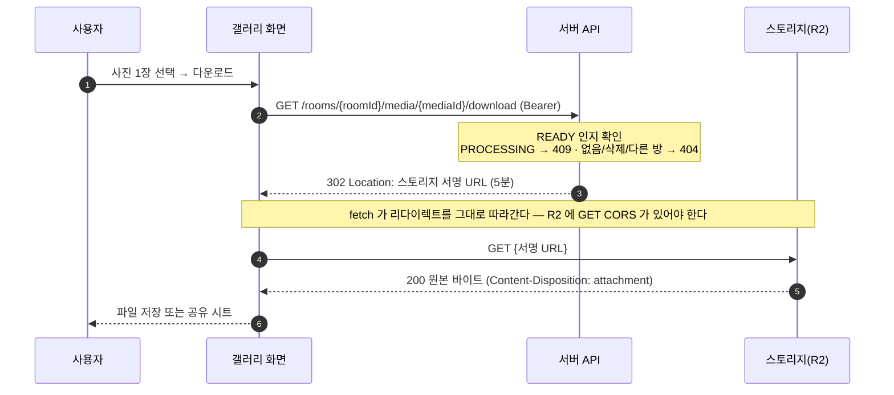
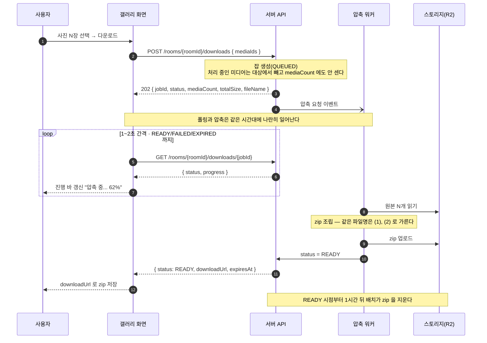

# 다운로드 흐름

사용자가 사진을 고른 순간부터 파일이 손에 들어오기까지,
프론트가 무엇을 어떤 순서로 부르는지 정리한 문서다.

저장 방식은 **사용자가 고른다** — 개별 파일 · zip · 사진첩(공유 시트) 셋 중 하나를 고른 다음 받는다.
그 세 가지가 서버 API **두 개** 위에 얹힌다.

관련 이슈: [#84 다운로드 API·압축 워커](https://github.com/woowacourse-teams/2026-sssOK/issues/84) ·
기능 명세: [003-selection-download.md](../requirements/features/003-selection-download.md)

---

## 세 가지 방식이 API 두 개 위에 얹힌다

사용자가 고르는 것은 **결과물의 모양**이다 — 파일 여러 개냐, zip 하나냐, 사진첩이냐.
그런데 서버가 주는 것은 **단건 다운로드**와 **zip 압축 잡** 둘뿐이다. 셋을 둘에 매핑해야 한다.

**시트에는 항상 항목이 두 개다.** 위 항목이 기기에 따라 바뀐다.



| 시트 항목            | 어디서 보이나 | 실제로 타는 길                            |
| -------------------- | ------------- | ----------------------------------------- |
| 개별로 저장          | 데스크톱      | 길 A 를 N번 반복해 각각 저장              |
| 사진첩에 저장        | 폰            | 길 A 로 받은 Blob 을 `navigator.share` 로 |
| .zip 일괄 다운로드   | 둘 다         | 길 B — 서버가 묶어준 zip 하나             |

**위 두 항목은 같은 API 를 탄다.** 둘 다 "한 장씩" 받는 것이고, 그 낱장이 다운로드 폴더로 가느냐
사진첩으로 가느냐만 다르다. 그래서 아래에서 길은 두 개만 그린다.

폰에서 낱장 저장 자리를 사진첩이 대신하는 이유는 [아래](#폰에서는-낱장-저장-자리를-사진첩이-대신한다)에 적었다.

> 제품 명세([003-selection-download.md](../requirements/features/003-selection-download.md))는 처음부터
> "사용자가 버튼으로 고른다"였다. 백엔드 명세의 `소량은 프론트가 개별 다운로드를 반복해 처리한다`
> 는 구현 전략 제안이었고, 팀은 제품 명세 쪽으로 정했다. 장수로 자동 판단하지 않는다.

---

## 길 A — 단건 다운로드



### 이 그림에서 놓치면 안 되는 것

- **서버가 바이트를 나르지 않는다.** API 는 서명 URL 을 가리키는 302 만 주고, 실제 파일은
  브라우저가 R2 에서 직접 받는다. 트래픽 비용이 서버를 타지 않는 대신, **R2 쪽 CORS 가 전제 조건**이 된다.
- **`Location` 을 읽어서 따로 처리할 수 없다.** `fetch` 에 `redirect: "manual"` 을 주면
  `opaqueredirect` 응답이 와서 헤더를 못 읽는다. 리다이렉트를 따라가 바이트를 받는 것 말고는 방법이 없다.
- **`Authorization` 헤더 때문에 preflight 가 뜬다.** API 서버의 CORS 설정에도 이 헤더가 열려 있어야 한다.
- **파일명은 서버가 붙인다.** 서명 URL 의 `Content-Disposition` 에 ASCII 폴백(`filename`)과
  RFC 5987 UTF-8(`filename*`)이 함께 실려 있어 한글 파일명도 깨지지 않는다.

### 응답과 에러

| 상태 | 코드              | 발생 상황                                                           |
| ---- | ----------------- | ------------------------------------------------------------------- |
| 302  | —                 | `Location` 에 서명 URL. 바디 없음                                   |
| 404  | `MEDIA_NOT_FOUND` | 없는 mediaId · 삭제됨 · 다른 방의 미디어 · `RESERVED`/`FAILED` 상태 |
| 409  | `MEDIA_NOT_READY` | 워커가 아직 처리 중(`PROCESSING`)인 미디어                          |

---

## 길 B — 서버 zip 잡

요청과 완성이 분리된다. `POST` 는 **잡 번호만** 즉시 돌려주고, 압축은 워커가 뒤에서 한다.



### 이 그림에서 놓치면 안 되는 것

- **`POST` 는 압축을 기다리지 않는다.** 202 는 "받아서 줄 세웠다"는 뜻이지 "다 됐다"가 아니다.
  `downloadUrl` 은 `READY` 일 때만 채워진다.
- **폴링은 세 상태에서 멈춘다.** `READY` · `FAILED` · `EXPIRED`. 이걸 안 걸면 영원히 돈다.
- **`mediaIds` 와 `folderId` 는 함께 못 쓴다.** 둘 다 생략하면 방 전체가 대상이다.
- **중복 파일명은 서버가 처리한다.** 프론트가 미리 손볼 필요가 없다.
  규칙은 확장자 **앞에** 공백을 포함한 `(n)` — `IMG_0421.jpg` → `IMG_0421 (1).jpg` → `IMG_0421 (2).jpg`.
- **`downloadUrl` 은 조회할 때마다 새로 서명된다.** 오래 들고 있다가 쓰면 안 되고, 받을 때 다시 조회한다.
- **완성된 zip 은 받아오지 말고 그 주소로 이동시킨다.** 서명 URL 에 `Content-Disposition: attachment`
  가 실려 있어 이동만으로 저장된다. `fetch` 로 Blob 을 만들면 스토리지 CORS 가 또 필요하고,
  수 GB 짜리 zip 이 통째로 메모리에 올라간다.

  > 지금 코드(`downloadMedia`)는 `fetch` 로 받아온다 — **목이 다른 오리진으로의 이동을
  > 가로챌 수 없어서**다. 실서버에 붙이는 이슈에서 이동으로 바꾼다.

### 응답과 에러

**`POST /rooms/{roomId}/downloads`** — 요청 바디는 `{ mediaIds }` 또는 `{ folderId }`

| 상태 | 코드               | 발생 상황                                                    |
| ---- | ------------------ | ------------------------------------------------------------ |
| 202  | —                  | `jobId` · `status` · `mediaCount` · `totalSize` · `fileName` |
| 400  | `INVALID_PARAM`    | `mediaIds` 와 `folderId` 동시 지정                           |
| 400  | `TOO_MANY_FILES`   | `mediaIds` 1001개 이상                                       |
| 404  | `MEDIA_NOT_FOUND`  | 유효한 대상이 하나도 안 남음 (처리 중 미디어를 뺀 결과 포함) |
| 404  | `FOLDER_NOT_FOUND` | 없는 `folderId`                                              |
| 429  | `RATE_LIMITED`     | 같은 사람의 동시 압축 잡 수 초과                             |

**`GET /rooms/{roomId}/downloads/{jobId}`**

| 상태 | 코드                 | 발생 상황                                                                                         |
| ---- | -------------------- | ------------------------------------------------------------------------------------------------- |
| 200  | —                    | `status` · `progress` · `mediaCount` · `fileName` · `downloadUrl` · `expiresAt` · `failureReason` |
| 403  | `DOWNLOAD_FORBIDDEN` | 다른 사람이 만든 잡을 조회                                                                        |
| 404  | `DOWNLOAD_NOT_FOUND` | 없는 `jobId`                                                                                      |
| 410  | `DOWNLOAD_EXPIRED`   | 보관 기간(기본 1시간) 초과                                                                        |

---

## 사진첩에 저장 — 별도 API 가 아니다

길 A 로 받은 Blob 을 그대로 `navigator.share({ files })` 에 넘겨 공유 시트를 띄운다. 서버는 관여하지 않는다.

폰에서 `<a download>` 로 받은 사진은 사진 앱이 아니라 **파일 앱**에 떨어진다. 사람들이 원하는 건
카메라롤이라, 공유 시트를 거쳐 "이미지 저장"을 누르게 하는 쪽이 실제로 원하는 자리에 놓인다.

### 지원하지 않는 기기에서는 버튼을 감춘다

`navigator.share` 가 있어도 **파일**은 못 받는 기기가 있다(맥 크롬 등). `navigator.share` 존재 여부가
아니라 실제 `File` 로 `canShare({ files })` 를 물어봐야 한다.

### 사파리는 제스처가 만료된다

공유 시트는 **사용자 제스처 안에서만** 열리는데, 바이트를 받아오느라 `await` 를 한 번이라도 하면
그 제스처가 만료된 것으로 본다. 그래서 시트가 거절당해도 실패로 두지 않는다.

> 받아온 것은 멀쩡하니 버리지 말고 **"N장 준비됨 → \[사진첩에 저장]"** 상태로 바를 바꾼다.
> 그 버튼을 누르는 것이 새 제스처가 되고, 핸들러에서 `await` 없이 곧바로 시트를 연다.
> 안드로이드는 대체로 첫 시도에 그냥 열린다.

---

## 폰에서는 낱장 저장 자리를 사진첩이 대신한다

**브라우저는 짧은 간격의 연속 다운로드를 막는다.** 악성 페이지가 다운로드 폴더에 파일을 쏟아붓는
것을 막으려는 보안 장치라, 사람이 클릭해서 생긴 짧은 **사용자 활성화** 창을 벗어난 다운로드는
"요청하지 않은 것" 으로 본다. 20장을 저장하려면 트리거가 20번 필요한데 창은 한 번뿐이다.

데스크톱 크롬은 두 번째 다운로드에서 "이 사이트에서 파일을 여러 개 다운로드하려고 합니다" 를
한 번 묻고, 허용하면 나머지를 통과시킨다. **iOS 사파리에는 그 프롬프트가 없다.** 첫 장 이후는
조용히 버린다 — 예외도 이벤트도 없어서 **몇 장이 실제로 저장됐는지 알아낼 방법조차 없다.**

그래서 폰에서는 **낱장 저장 항목을 아예 내주지 않는다.** 그 자리에 "사진첩에 저장" 이 앉는다.
어차피 폰에서 낱장으로 받고 싶은 사람의 목적지는 파일 앱이 아니라 사진첩이다.

| 시트 위 항목  | 데스크톱             | 폰                    |
| ------------- | -------------------- | --------------------- |
| 문구          | 개별로 저장          | **사진첩에 저장**     |
| 설명          | 한 장씩 원본 그대로  | 한 장씩 사진 앱으로   |
| 하는 일       | 다운로드 폴더에 낱장 | 공유 시트 → 사진첩    |

**항목을 숨기는 게 아니라 바꿔 끼운다.** 눌러도 안 되는 버튼을 남기지 않으면서, 문구가 실제로
일어날 일을 그대로 말하게 된다.

### 기기 판별

`canShareFiles()` **하나만으로는 안 된다.** 윈도우 크롬·엣지도 파일 공유를 지원해서, 그것만 보면
데스크톱 사용자가 다운로드 폴더 대신 공유 시트로 끌려간다.

그래서 **파일 공유 지원**과 **터치가 주 입력인지**를 함께 본다 (`prefersShareSheet`).

```ts
canShareFiles() && matchMedia("(pointer: coarse)").matches;
```

iOS·안드로이드는 사진첩으로, 윈도우 데스크톱은 낱장 저장으로 간다.
터치 노트북·윈도우 태블릿이 사진첩 쪽으로 가는 것은 감수한다 — 둘 다 시트가 열리기는 한다.

`navigator.userAgentData.mobile` 은 깔끔하지만 **사파리에 없어서** 정작 필요한 기기에서 못 쓴다.

---

## 붙이기 전에 풀어야 할 것

### 1. R2 GET CORS

길 A 와 사진첩 저장이 여기에 달려 있다. 열려 있지 않으면 응답이 통째로 막히고, 프론트에서는
상태 코드조차 없이(`status: 0`) 실패로만 보인다.

[R2_PRESIGNED_UPLOAD.md](../backend/R2_PRESIGNED_UPLOAD.md) 의 "확인하지 않은 것" 첫 줄에 있는 항목이다.
그 문서는 업로드(PUT)를 기준으로 썼지만, **다운로드(GET)도 같이 열려야 한다.**

### 2. 명세 문서와 실제 코드가 어긋난 곳

문서 기준으로 타입을 짜면 깨진다. 붙이기 전에 어느 쪽이 맞는지 확정해야 한다.

| 항목           | 명세 문서                | 실제 코드                                      |
| -------------- | ------------------------ | ---------------------------------------------- |
| `jobId`        | `String` — `"dl_7d1e93"` | **`Long`** (`@PathVariable Long jobId`)        |
| zip 파일명     | `sssOK_1024.zip`         | `ShareDrop_{roomCode}.zip`                     |
| B-7 응답       | 바디 그대로              | **`ApiResponse` 래핑** — `{ "data": { ... } }` |
| `expiresAt`    | `+09:00`                 | `Instant` → `...Z` (UTC)                       |
| 보관 기간 기준 | 생성 후 1시간            | **`READY` 시점부터** 1시간                     |

`jobId` 가 가장 위험하다. 문서대로 `"dl_7d1e93"` 을 보내면
`GET /rooms/{roomId}/downloads/dl_7d1e93` 이 400 이다.

> B-6(단건)만 `ApiResponse` 래핑이 없다. 302 에 바디가 없어서다.
> `apiClient` 는 `{ data }` 를 벗겨내므로, 이 요청만 다른 경로로 보내야 한다.

---

## 목으로 어디까지 확인되나

세 엔드포인트가 [`mocks/handlers/download.ts`](../../frontend/src/mocks/handlers/download.ts) 에 있다.
실제 서버가 아직 `main` 에 없어서, **지금은 이 목이 유일하게 동작하는 계약이다.**

**목이 서버 워커 역할을 그대로 한다.** 잡을 만들면 원본을 실제로 받아 zip 을 조립하고, 그동안
진행률이 오른다. 가짜 진행률을 흘리면 "다 됐다는데 파일이 없다" 같은 어긋남을 실서버에 붙일
때까지 못 잡는다. 압축기는 [`mocks/zip/`](../../frontend/src/mocks/zip/) 에 있다 —
zip 을 만드는 것은 서버 일이라 목 쪽에 둔다.

| 확인되는 것                                              | 확인 안 되는 것                       |
| -------------------------------------------------------- | ------------------------------------- |
| 302 리다이렉트를 `fetch` 가 따라가 바이트를 받는 것       | R2 GET CORS (목은 CORS 를 안 건다)    |
| 잡 생성 → 폴링 → READY → zip 저장까지 전 구간            | 실제 서버의 압축 시간·실패 양상       |
| 에러 8종 응답                                            | zip 을 이동으로 받는 경로             |
| 파일명 중복 `(1)`·`(2)` 와 `ShareDrop_{roomCode}.zip`     | 대용량(수 GB) zip 의 메모리·시간      |

목은 `(1)` 부터 붙이는 서버 규칙(`DownloadFileNames.deduplicate`)을 그대로 따른다.
프론트는 중복 처리를 하지 않는다.
