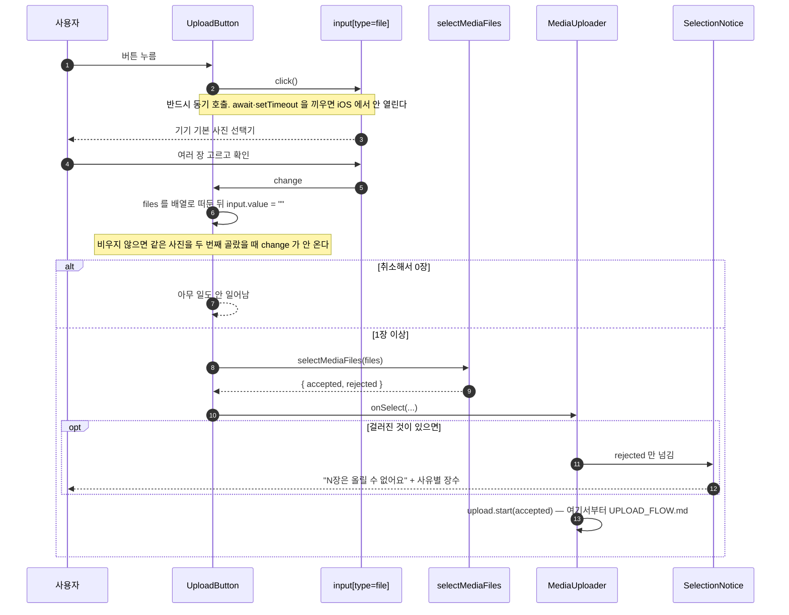

# 사진 선택 진입점

사용자가 업로드 버튼을 누른 순간부터 **"올릴 파일 목록" 이 만들어지기까지**를 다룬다.
그 뒤(발급·PUT·등록)는 [UPLOAD_FLOW.md](./UPLOAD_FLOW.md) 가 이어받는다.

관련 이슈: [#72 사진 선택](https://github.com/woowacourse-teams/2026-sssOK/issues/72)

> **이 문서를 먼저 읽어야 하는 사람** — 업로드 버튼 UI 를 만드는 사람.
> 갈아끼울 것과 남겨야 할 것이 [아래](#버튼을-갈아끼울-때)에 있다.

---

## 한눈에

`features/upload-media/` 중 **고르는 일에 관여하는 것만** 추린 것이다.
전송 쪽(`api/`, `uploadFiles`, `useMediaUpload` 등)은 [UPLOAD_FLOW.md](./UPLOAD_FLOW.md) 를 본다.

```
features/upload-media/
├── lib/mediaFileRules.ts      확장자·용량 규칙 (서버 MediaType 미러)
├── model/selectMediaFiles.ts  고른 파일을 accepted / rejected 로 가름
└── ui/
    ├── UploadButton.tsx       버튼 + 숨긴 file 입력   ← 버튼 UI 가 들어올 자리
    ├── SelectionNotice.tsx    걸러진 파일 안내
    └── MediaUploader.tsx      고르기부터 실패 모달까지 한 흐름으로 잇는다
```

화면이 쓰는 것은 `MediaUploader` 하나다. 갤러리(`pages/gallery`)가 이것만 놓으면
고르기 → 전송 → 진행 바 → 실패 모달이 전부 딸려온다.

## 흐름



## 검증 규칙

파일마다 두 관문을 지난다. 하나라도 걸리면 `rejected` 로 가고, 나머지는 계속 진행한다.

| 관문                               | 거절 코드               | 사용자에게                                   |
| ---------------------------------- | ----------------------- | -------------------------------------------- |
| `mediaKindOf(file.name)` 이 `null` | `UNSUPPORTED_FILE_TYPE` | 이미지와 영상만 올릴 수 있어요               |
| `file.size > maxBytesOf(kind)`     | `FILE_SIZE_EXCEEDED`    | 사진은 10MB / 영상은 1GB 까지 올릴 수 있어요 |

허용 확장자는 `jpg` `jpeg` `png` `gif` `mp4` `webm` `mov` 다.

### 왜 `File.type` 을 안 보나

**아이폰 사파리가 거짓말을 한다.** 파일명이 `.HEIC` 인데 `file.type` 으로 `image/jpeg` 를 주거나,
아예 빈 문자열을 준다. 그래서 **파일명 확장자로만** 판별한다.
`<input accept>` 도 마찬가지로 믿으면 안 된다 — 선택기를 좁혀 보여줄 뿐이고,
데스크톱에서 "모든 파일" 로 바꾸면 그대로 넘어온다.

### 왜 서버가 할 검사를 여기서 또 하나

서버도 같은 검사를 한다. 그래도 먼저 거르는 이유는 **회선**이다.
1GB 짜리를 다 올린 뒤에 거절당하면 사용자는 업로드 시간을 통째로 버린 셈이 된다.

규칙은 서버 [`MediaType.java`](../../backend/src/main/java/com/sssok/domain/file/MediaType.java) 를
그대로 옮긴 것이다. **한쪽만 고치면 프론트는 통과시켰는데 발급이 거절하는 상태**가 되고,
사용자는 같은 파일을 두 번 거절당한다. 고칠 때는 양쪽을 같이 고친다.

### `.heic` 은 지금 거절된다

의도된 동작이다. 서버 `MediaType` 에 heic 이 없어서 통과시켜도 발급에서 막힌다.
[UPLOAD_FLOW.md](./UPLOAD_FLOW.md) 의 "HEIC 는 프론트에서 JPEG 로 변환해 올린다" 결정은
**문서만 있고 구현도 이슈도 없다.** 되살릴 때 고칠 곳은 `selectMediaFiles` 의 분기 하나다.

아이폰 기본 포맷이라 실사용에서 가장 먼저 부딪히는 자리다.

---

## 알림은 "못 올리는 것" 만 말한다

`SelectionNotice` 는 **걸러진 파일만** 보여준다. 고른 장수는 말하지 않는다.

올라갈 장수는 진행 바가 `0 / 8` 로 이미 말하고 있어서 같은 말이 두 번 뜨고,
업로드가 끝난 뒤에도 그 문구가 남아 다 올라간 화면에 지난 얘기만 놓인다.
시안(12) 의 업로드 중·실패 화면 어디에도 그 알림은 없다.

반대로 걸러진 파일은 애초에 업로드에 끼지 않아 **진행 바가 대신 말해주지 못한다.**
그건 알림에 남아야 사용자가 장수가 줄어든 이유를 안다.

사유는 파일명이 아니라 **사유별 장수**로 접는다 — 30장을 걸렀을 때 이름을 한 줄씩
늘어놓으면 화면을 덮는다.

### 서버가 거절한 파일은 아직 안 보인다

여기서 거르는 것은 **전송 전, 브라우저가 스스로 판정한 것**뿐이다.
발급 단계에서 서버가 돌려보낸 `rejected` 는 `uploadFiles` 가 `onRejected` 로 알려주는데,
`MediaUploader` 가 그 콜백을 **비워뒀다.** 그래서 서버 거절은 화면에 아무 흔적도 남지 않는다.

붙이는 자리는 정해져 있다 — 알림에서 "고른 장수" 를 뺀 뒤로는 거절 목록에 덧붙이기만 하면 된다.
후속 이슈가 아직 없다.

---

## 버튼을 갈아끼울 때

`UploadButton.tsx` 의 `InterimButton` 은 누를 수 있다는 것만 알리는 임시 테두리다.
**그것만 지우고 자리를 넘기면 된다.**

```tsx
// 이 styled 컴포넌트를 지우고
const InterimButton = styled.button`...`;

// JSX 의 이 줄만 새 버튼으로 바꾼다
<InterimButton type="button" onClick={() => inputRef.current?.click()}>
```

### 남겨야 하는 것

버튼 모양과 무관한데 지우면 조용히 깨지는 것들이다.

- **`onClick` 안에서 `click()` 을 동기로 부르는 것.** `await` 나 `setTimeout` 뒤로 옮기면
  사용자 제스처 밖이 되어 iOS 에서 선택기가 안 열린다.
- **`input.value = ""`.** 브라우저는 직전과 같은 값이면 `change` 를 보내지 않는다.
  비우지 않으면 **같은 사진을 연속으로 두 번 고를 수 없다.** 눈에 잘 안 띄는 버그다.
- **입력을 `display: none` 으로 숨기지 않는 것.** 사파리가 그런 입력의 `click()` 을
  무시하는 경우가 있어서 잘라서(`clip-path`) 숨겨뒀다.
- **입력의 `aria-hidden` 과 `tabIndex={-1}`.** 누름을 받는 건 버튼이라,
  선택기까지 접근성 트리에 있으면 컨트롤이 둘로 보인다.

### 아직 확인 못 한 것

**아이폰·안드로이드 실기기에서 선택기가 열리는지 못 봤다.** 데스크톱 크롬에서만 확인했다.
iOS 의 알려진 두 함정은 피했지만, 안 열리면 고치는 방법은 **버튼을 `<label>` 로 바꿔
입력을 감싸는 것**이다. 라벨 활성화는 브라우저가 직접 처리해서 확실하다.

그래서 버튼 스타일을 emotion styled 로 잡아두면 좋다 — 그 경우 `.withComponent("label")`
로 태그만 갈아끼울 수 있어서 모양을 그대로 살릴 수 있다.

---

## 여기서 끝나고, 전송이 이어받는다

`selection.accepted` 는 곧바로 `upload.start()` 로 넘어간다. 조각이 어디에 있는지는 이렇다.

| 조각                              | 이슈              | 문서                               |
| --------------------------------- | ----------------- | ---------------------------------- |
| 고르고 거르기                     | **#72 — 이 문서** | —                                  |
| 발급 → PUT → 등록 (`uploadFiles`) | #75               | [UPLOAD_FLOW.md](./UPLOAD_FLOW.md) |
| 진행 바 (`UploadProgressBar`)     | #73               | [UPLOAD_FLOW.md](./UPLOAD_FLOW.md) |
| 실패 모달 (`UploadFailureModal`)  | #74               | [UPLOAD_FLOW.md](./UPLOAD_FLOW.md) |
| 서버 없이 굴리는 목               | #71               | [UPLOAD_MOCK.md](./UPLOAD_MOCK.md) |

조립은 `MediaUploader` 가 한다 — 넷을 잇는 유일한 자리다. 갤러리는 `roomId`·`token`·
열어둔 `folderIds` 를 프롭으로 넘기고, 등록이 끝나면 `onUploaded` 로 목록 갱신만 받는다.

### 이 진입점에 아직 없는 것

- **드래그 앤 드롭** — [002-upload.md](../requirements/features/002-upload.md) 의
  "화면 아무 곳에나 파일을 끌어다 놓아도 된다" 가 구현도 이슈도 없다.
  PC 에서 쓰는 취합 담당자가 주 사용자라는 걸 생각하면 작지 않다.
- **방장만 업로드일 때 버튼 숨김** — 방 조회 응답의 `uploadPolicy` 로 알 수 있는데
  화면이 그 값을 읽지 않는다. 지금은 눌러서 발급 403 을 받고서야 안다.
