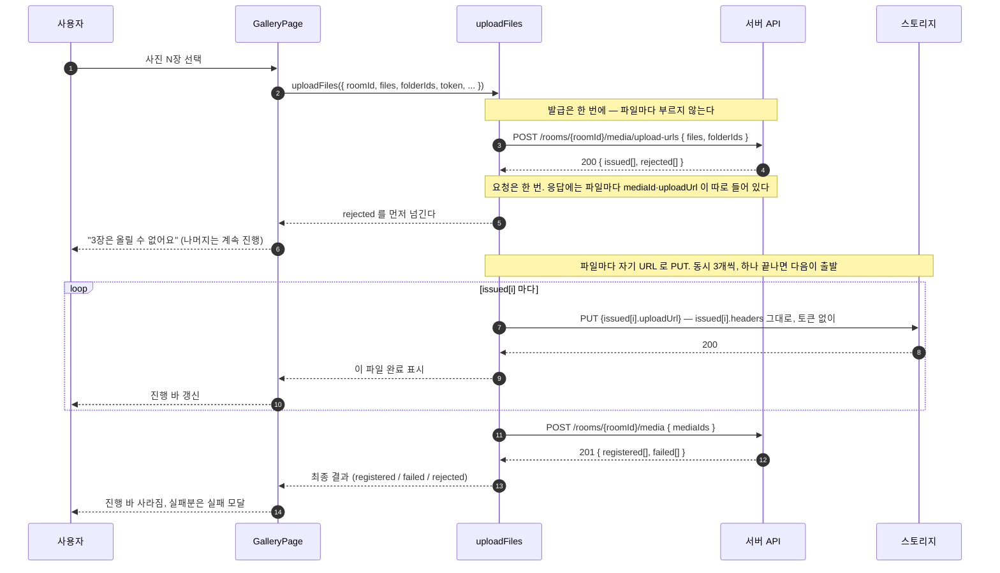
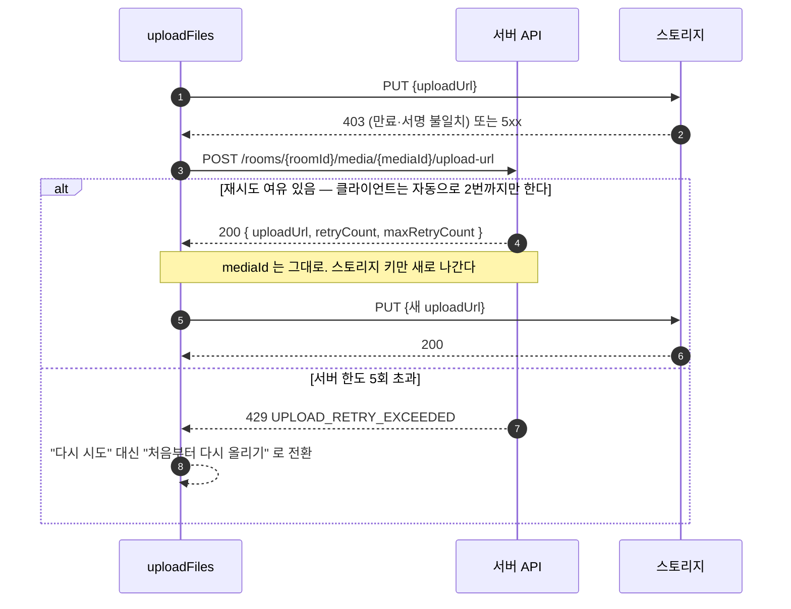
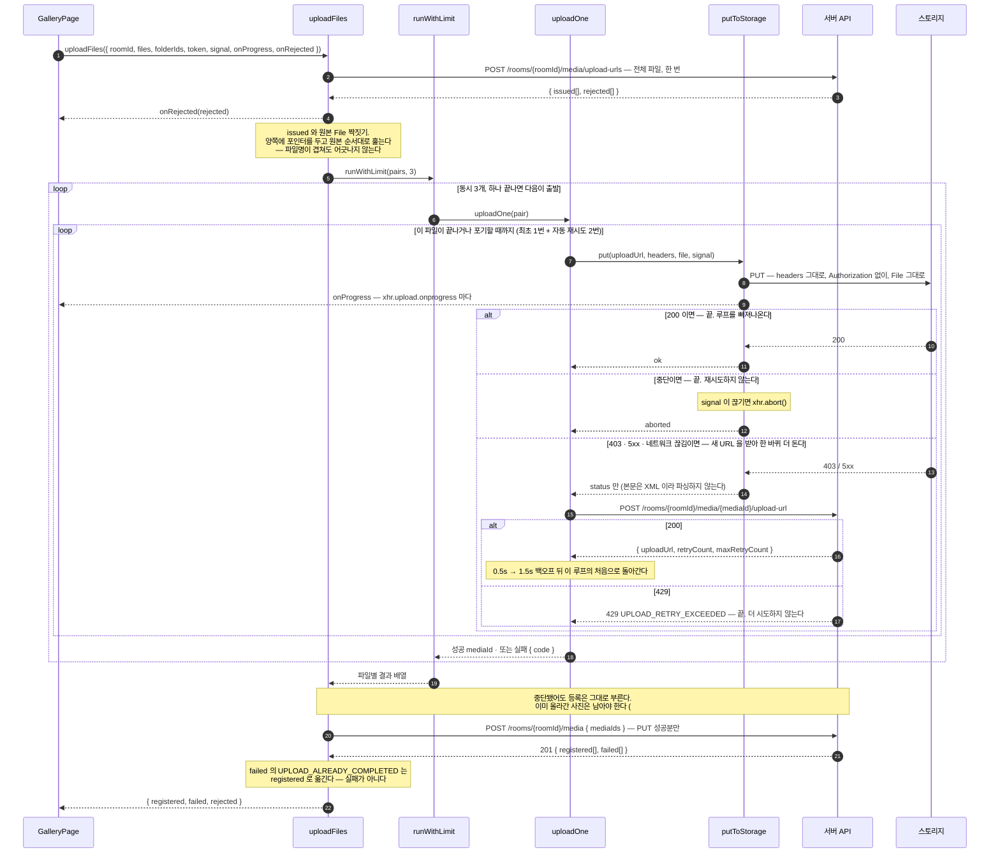

# 업로드 흐름

사용자가 사진을 고른 순간부터 갤러리에 올라가기까지,
프론트가 무엇을 어떤 순서로 부르는지 정리한 문서다.

> 목이 실제로 어떻게 답하는지는 [UPLOAD_MOCK.md](./UPLOAD_MOCK.md) 를 본다.
> 그쪽이 지금 동작하는 계약이고, 이 문서는 그 계약을 쓰는 쪽 이야기다.

관련 이슈: [#75 요청 흐름](https://github.com/woowacourse-teams/2026-sssOK/issues/75) ·
[#72 사진 선택](https://github.com/woowacourse-teams/2026-sssOK/issues/72) ·
[#73 진행 상황 바](https://github.com/woowacourse-teams/2026-sssOK/issues/73) ·
[#74 실패 모달](https://github.com/woowacourse-teams/2026-sssOK/issues/74) ·
[#76 서버 API](https://github.com/woowacourse-teams/2026-sssOK/issues/76)

---

## 전체 흐름



### 이 그림에서 놓치면 안 되는 것

- **발급은 한 번, PUT과 등록은 파일 단위다.** 발급을 파일마다 부르면 `rejected` 로 부분 실패를
  갈라주는 설계가 무의미해지고, 30장이면 요청이 90번 나간다.
- **PUT은 `apiClient` 를 타면 안 된다.** 토큰이 자동으로 붙어 403 이 난다. `XMLHttpRequest` 로 직접 보내고,
  헤더는 발급 응답의 `headers` 를 **그대로** 싣는다.
- **`rejected` 는 즉시 사용자에게 알린다.** 업로드가 끝날 때까지 기다릴 이유가 없다.
  올릴 수 없다는 건 발급 시점에 이미 확정이다.
- **`mediaId` 가 손잡이다.** `storageKey` 는 응답에 없고, 알 필요도 없다.

---

## 실패했을 때 — 재발급

PUT이 403이나 5xx로 깨진 파일은 **처음부터 다시 올리는 게 아니라** 새 URL만 받아 이어서 올린다.



**옛 URL은 무효화되지 않는다.** 서명이 URL에 박혀 있어 취소할 방법이 없다. 대신 서버가
스토리지 키를 갈아끼우므로, 뒤늦게 도착한 옛 PUT은 200을 받되 고아 객체가 될 뿐 새 파일을 덮지 않는다.
그래도 **클라이언트는 옛 요청을 `AbortController` 로 끊는 게 맞다** — 쓸데없이 대역폭을 먹는다.

---

## 사용자가 다시 올릴 때 — 실패 모달

자동 재발급까지 다 쓰고도 깨진 파일이 남으면, 한 판이 끝난 뒤 **실패 장수만** 모달로 알리고
재시도 버튼을 준다. 자동 재시도와 사용자 재시도는 **다른 것을 다시 한다.**

|           | 자동 재시도 (재발급)        | 사용자 재시도 (실패 모달)        |
| --------- | --------------------------- | -------------------------------- |
| 언제      | PUT 이 깨진 그 자리에서     | 한 판이 다 끝난 뒤               |
| 무엇을    | 같은 `mediaId` 에 새 URL 만 | 발급부터 다시 — **새 `mediaId`** |
| 몇 번     | `MAX_AUTO_RETRY` 번까지     | 사용자가 누르는 만큼             |
| 서버 한도 | 5회를 공유해 소진한다       | 새 미디어라 처음으로 돌아간다    |

마지막 줄이 `429 UPLOAD_RETRY_EXCEEDED` 로 실패한 파일에도 재시도 버튼을 주는 근거다.
재발급이 막힌 것이지 새로 발급받는 것까지 막힌 게 아니다.

### 모달에 오는 것과 오지 않는 것

모달의 문구는 "예기치 못한 이유로 업로드에 실패했어요" 하나뿐이다. **사유를 나누지 않는다** —
그래서 그 문장이 참이 아닌 것은 애초에 이 모달에 오면 안 된다.

|                                                              | 모달        | 왜                                                        |
| ------------------------------------------------------------ | ----------- | --------------------------------------------------------- |
| `UPLOAD_FAILED` · `UPLOAD_NOT_COMPLETED` · `MEDIA_NOT_FOUND` | 온다        | 다시 올리면 될 수도 있다                                  |
| `UPLOAD_RETRY_EXCEEDED`                                      | 온다        | 새 발급이라 한도가 초기화된다                             |
| `UPLOAD_ABORTED`                                             | **안 온다** | 사용자가 스스로 취소했다. 실패가 아니다                   |
| `FILE_SIZE_EXCEEDED`                                         | **안 온다** | 파일이 한도를 넘었다. 몇 번을 올려도 같은 자리에서 걸린다 |
| `rejected` 전부                                              | **안 온다** | 발급 단계에서 확정된 거절이다. 이미 따로 알렸다           |

**모달의 N 은 재시도 목록의 길이다.** 세는 곳과 다시 올리는 곳이 갈리면
"2장을 못올렸어요" 라고 해놓고 1장만 다시 올라가는 일이 생긴다.

재시도한 판도 끝나면 같은 자리로 돌아온다. 또 깨진 게 있으면 줄어든 장수로 모달이 다시 뜨고,
전부 올라갔으면 그대로 닫힌다 — 몇 번을 돌든 규칙은 이 하나다.

**닫아도 올라간 것은 그대로 남는다.** 성공분은 이미 서버에 등록이 끝났다.
실패가 있다고 해서 무를 것이 아니다.

---

## 파일 하나의 상태

화면이 그려야 하는 건 배치 전체가 아니라 **파일 하나하나의 상태**다.

```
선택됨
  ├─(발급 rejected)──────────────→ 올릴 수 없음   ← 사유를 그대로 보여준다
  └─(발급 issued)─→ 올리는 중
                      ├─(PUT 200)──→ 등록 대기 ─(등록 성공)─→ 완료
                      │                          └─(등록 failed)─→ 실패
                      └─(PUT 실패)─→ 재발급 중 ─┬─(200)→ 올리는 중 (되돌아감)
                                                 └─(429)→ 실패 (재시도 불가)
```

`rejected` 와 `failed` 는 사용자에게 다르게 보여야 한다.

- **`rejected`** — 파일 자체가 조건에 안 맞는다. **다시 눌러도 똑같이 실패한다.** 재시도 버튼을 주면 안 된다.
- **`failed`** — 전송이 어쩌다 깨졌다. **재시도가 의미 있다.**

---

## 모듈 안쪽 — 무엇이 무엇을 부르나

위 그림이 "서버·스토리지를 어떤 순서로 부르나" 였다면, 이건 그걸 실제로 굴리는 코드가
어떻게 나뉘어 있는지다. `uploadFiles` 하나가 다 하지 않는다.

| 파일                            | 하는 일                                                             |
| ------------------------------- | ------------------------------------------------------------------- |
| `model/uploadFiles.ts`          | 오케스트레이터. 발급 → 풀 → 등록, 결과 세 갈래로 병합               |
| `lib/runWithLimit.ts`           | 동시 실행 개수 제한. 하나 끝나면 다음을 시작한다                    |
| `model/pairWithFiles.ts`        | 발급 결과와 원본 `File` 짝짓기. 거절로 빠진 자리를 건너뛴다         |
| `model/uploadOne.ts`            | 파일 한 건. PUT → (깨지면) 재발급 → 재PUT                           |
| `lib/waitUnlessAborted.ts`      | 백오프 대기. 기다리는 중에 취소되면 곧바로 깨어난다                 |
| `lib/putToStorage.ts`           | 부를 때마다 `XMLHttpRequest` PUT 한 번. 진행률과 중단이 여기 달린다 |
| `api/*.ts`                      | 서버 3-API. 여기는 `apiClient` 를 그대로 쓴다                       |
| `config.ts`                     | 동시 3개 · 자동 재시도 2회 · 백오프 `[500, 1500]`ms                 |
| `model/types.ts` `api/types.ts` | 계약                                                                |

밖에서 쓰는 건 `index.ts` 가 내보내는 `uploadFiles` 하나뿐이다. 나머지는 전부 내부 조각이다.

**`apiClient` 를 못 쓰는 건 스토리지 PUT 하나뿐이다.** 발급·등록·재발급은 우리 서버이고
응답도 `{ data }` 로 감싸여 오므로 `apiClient` 를 쓴다. 헷갈리기 쉬운 지점이라 적어둔다.



### 이 그림에서 놓치면 안 되는 것

- **`onRejected` 가 결과보다 먼저 나간다.** 결과는 등록까지 끝나야 나오는데, 거절은 발급 시점에
  이미 확정이라 기다릴 이유가 없다. 그래서 반환값이 아니라 콜백이다.
- **재발급 루프는 `uploadOne` 안에서 끝난다.** 오케스트레이터는 파일 한 건이 몇 번 재시도했는지
  모른다. 성공했는지 아닌지만 받는다.
- **`putToStorage` 는 상태 코드만 돌려준다.** R2 오류 본문은 XML 이라 우리 `ApiError` 가 아니다.
  파싱하지 않고, 판단은 부르는 쪽이 한다.
- **중단해도 완료 등록은 부른다.** 중단은 "아직 안 올라간 것을 그만두는" 것이지
  "올라간 것을 무르는" 게 아니다. 이미 PUT 이 끝난 사진은 등록해서 갤러리에 남긴다
  ([#73](https://github.com/woowacourse-teams/2026-sssOK/issues/73) 완료 조건).
- **진행률은 `putToStorage` 에서 곧장 호출자로 간다.** 파일 단위 이벤트라 합산은 받는 쪽(#73) 몫이다.
  여기서 미리 합치면 "3/30장" 과 "27%" 중 하나만 만들 수 있게 된다.

---

## 에러를 화면에 어떻게 옮길지

| 어디서 | 응답                                        | 화면                                                                                                             |
| ------ | ------------------------------------------- | ---------------------------------------------------------------------------------------------------------------- |
| 발급   | `rejected` `UNSUPPORTED_FILE_TYPE`          | 파일명과 함께 "이미지와 영상만 올릴 수 있어요". 나머지는 그대로 진행                                             |
| 발급   | `rejected` `FILE_SIZE_EXCEEDED`             | "사진은 10MB까지 올릴 수 있어요"                                                                                 |
| 발급   | `403 NOT_ROOM_HOST`                         | 방장만 올릴 수 있는 방. **업로드 버튼 자체를 미리 숨기는 게 낫다** — 방 조회 응답의 `uploadPolicy` 로 알 수 있다 |
| 발급   | `403 NOT_ROOM_MEMBER`                       | 세션이 끊긴 상황. 입장 화면으로 되돌린다                                                                         |
| 발급   | `410 ROOM_EXPIRED` / `ROOM_ALREADY_DELETED` | 만료·삭제 화면으로                                                                                               |
| 발급   | `404 FOLDER_NOT_FOUND`                      | 열어둔 폴더가 지워졌다. 루트로 올릴지 물어본다                                                                   |
| PUT    | `403`                                       | **사용자에게 안 보인다.** 재발급 후 자동 재시도                                                                  |
| PUT    | `5xx` · 네트워크 끊김                       | 마찬가지로 자동 재시도. 한도를 넘으면 그때 실패로 표시                                                           |
| 재발급 | `429 UPLOAD_RETRY_EXCEEDED`                 | 실패 모달로. 재시도는 재발급이 아니라 **새 발급**이라 한도가 초기화된다                                          |
| 등록   | `failed` `UPLOAD_NOT_COMPLETED`             | 재시도 대상. 재발급부터 다시                                                                                     |
| 등록   | `failed` `UPLOAD_ALREADY_COMPLETED`         | 이미 올라간 것이다. **실패로 보여주면 안 된다** — 성공으로 합친다                                                |

마지막 줄이 걸리기 쉽다. 네트워크가 불안해 등록 요청이 두 번 나가면 두 번째가 이 코드를 받는데,
이걸 실패로 표시하면 사용자는 멀쩡히 올라간 사진을 실패로 본다.

---

## 이미 정해진 것 (#75)

이슈 [#75](https://github.com/woowacourse-teams/2026-sssOK/issues/75) 가 못 박아둔 제약이다.
나중에 갈아엎지 않으려면 처음부터 지켜야 한다.

| 제약                                      | 이유                                                                                                 |
| ----------------------------------------- | ---------------------------------------------------------------------------------------------------- |
| **`XMLHttpRequest` 로 작성한다**          | `fetch` 에는 업로드 진행 이벤트가 없다. 진행 바를 붙일 때 통째로 다시 써야 한다                      |
| **`shared/api/apiClient` 를 쓰지 않는다** | 접두사·토큰을 붙이고 `{ data }` 를 파싱하는데, 스토리지 PUT 은 외부 도메인이고 응답 본문이 비어 있다 |
| **`File` 을 그대로 전송한다**             | `readAsArrayBuffer` 등으로 읽으면 아이폰에서 메모리로 죽는다                                         |
| **스토리지 오류 응답을 파싱하지 않는다**  | R2 오류는 XML 이라 우리 `ApiError` 형식이 아니다                                                     |
| **동시 실행 개수를 제한한다**             | 나머지는 대기했다가 앞선 파일이 끝나면 시작. 숫자는 아래에서 3으로 정했다                            |
| **중단을 지원한다**                       | 중단 요청을 받으면 진행 중인 PUT 이 실제로 취소돼야 한다                                             |

### 2026-08-26 에 정한 값

위 제약을 지키는 선에서 숫자를 정했다. 값은 `frontend/src/features/upload-media/config.ts` 에 있다.

| 정한 것          | 값                           | 근거                                                                         |
| ---------------- | ---------------------------- | ---------------------------------------------------------------------------- |
| 동시 업로드 개수 | **3**                        | 아래 만료 계산. HTTP/1.1 이면 브라우저가 호스트당 6개로 어차피 막는다        |
| 완료 등록 시점   | **전부 끝나고 한 번**        | 요청이 1회로 끝난다. 묶어 부르는 ⓑ 로 바꾸려면 오케스트레이터만 고치면 된다  |
| 자동 재시도      | **2회 + 백오프 0.5s · 1.5s** | 서버 한도는 5회지만 다 쓰면 실패가 확정될 때까지 사용자를 너무 오래 붙잡는다 |

## 아직 정하지 않은 것

아래는 아직 팀에서 합의하지 않은 항목이다.

| #   | 정할 것                 | 선택지                                                                                                                         |
| --- | ----------------------- | ------------------------------------------------------------------------------------------------------------------------------ |
| 1   | **실제 상향 회선 속도** | 아무도 안 재봤다. 지금 문서의 1Mbps 는 가정이다. **실기기로, 사람 몰린 실제 행사장에서** 재야 한다 — 여기서 동시 개수가 갈린다 |
| 2   | **아이폰 실사진 측정**  | 지금 측정은 아이폰 원본이 아니다. 실사진 한 장이면 변환 후 절대 크기와 품질 최종값(`0.80` 잠정)이 같이 확정된다                |

### 동시 3개의 근거 — 만료가 걸린다

발급 링크는 **전부 같은 순간에** 10분 시계를 건다. 순차로 올리면 뒤쪽 파일은 자기 차례가 오기 전에 만료된다.
서명은 요청이 **시작될 때** 검사하므로, 동시성이 높을수록 마지막 파일이 일찍 출발해 안전하다.

```
3.4MB × 30장, 상향 1Mbps (약 27초/장)   ← 둘 다 아직 확정값이 아니다

동시 1개 → 30번째가 출발하는 시각 ≈ 783초   x 600초를 넘겨 만료 → 재발급
동시 3개 → 30번째가 출발하는 시각 ≈ 261초   o
```

**두 입력 다 확정값이 아니다.** 3.4MB 는 아래 [HEIC 절](#heic-는-프론트에서-jpeg-로-변환해-올린다)의
측정에서 끌어온 값이지만, 거기 적어둔 대로 **아이폰 실사진으로는 아직 안 재봤다**(미정 2번).
1Mbps 는 **아무도 재보지 않은 순수한 가정**이다 — 최악값으로는 말이 되지만(행사장은 셀이 붐빈다)
이 숫자 하나가 지금 동시성과 만료 여유를 혼자 정하고 있다(미정 1번).
**아래 계산은 그 두 값이 확정되기 전까지 잠정이다.**

회선이 5Mbps 면 같은 계산이 동시 1개에서도 157초로 끝나 만료가 아예 문제가 아니게 된다.
**즉 "동시 3~4개" 의 근거는 만료가 아니라 아래 두 줄이어야 한다.**

반대로 너무 높이면 대역폭이 나뉘어 아무것도 안 끝나고, 진행 바가 다 같이 멈춰 있는 모양이 된다.
HTTP/1.1 이면 브라우저가 호스트당 6개로 어차피 막는다. **3~4개가 흔한 절충값이다.**

사진이 100장 단위로 늘면 발급 자체를 20장씩 끊어 부르는 방법도 있다. 링크가 쓰기 직전에 발급돼
만료 여유가 넉넉해지지만, `rejected` 안내가 여러 번 나뉘어 온다.

## HEIC 는 프론트에서 JPEG 로 변환해 올린다

2026-08-26 결정. 아이폰 기본 포맷인 `.heic` 을 어디서 처리할지에 대한 답이다.

### 규칙

> `.heic` / `.heif` 는 **발급 요청 전에** 브라우저에서 JPEG 로 변환해 올린다.
> 변환은 세 단계로 시도한다.
>
> 1. **브라우저 네이티브 디코드** — `new Image()` + 캔버스. 아이폰 사파리는 여기서 끝난다
> 2. **wasm 디코더** — 실패하면 `libheif-js` 를 동적 import 해서 푼다. PC 크롬이 여기로 온다
> 3. **거절** — 둘 다 실패하면 "올릴 수 없어요" 로 안내한다

2단계가 없으면 **PC 크롬에서 `.heic` 을 아예 못 올린다.** 크롬은 HEIC 를 디코드하지 못한다 —
Chrome 148 에서 `new Image()` 와 `createImageBitmap` 이 모두 실패하는 것을 확인했다
(`The source image could not be decoded`). 같은 디코더를 쓰므로 네이티브 우회로는 없다.

wasm 비용은 재봤다. 걱정할 수준이 아니다.

| 측정 (libheif-js 1.19.8) | 값                                                                     |
| ------------------------ | ---------------------------------------------------------------------- |
| 디코드                   | 9.1MP 757KB 기준 **약 0.2초**. 아이폰 12MP 환산 약 0.25초              |
| JPEG 인코딩까지          | 합쳐서 **0.4~0.5초/장**. 30장이면 12~15초                              |
| 번들                     | **gzip 509KB**. `.heic` 을 만났을 때만 동적 import 하므로, 안 만나면 0 |

CPU 비용은 이걸로 끝이다. 그런데 **변환의 진짜 비용은 CPU 가 아니라 늘어난 바이트다.**
변환하는 순간 회선에 실리는 양이 바뀌기 때문이다.
같은 파일(4032×2268, HEIC 757KB)을 디코드해 품질별로 다시 인코딩해 재봤다.

| `toBlob` 품질 | 크기       | HEIC 대비 | PSNR    |
| ------------- | ---------- | --------- | ------- |
| 0.95          | 1.65MB     | 2.24x     | 46.6 dB |
| **0.92**      | **1.26MB** | **1.71x** | 45.2 dB |
| 0.90          | 1.16MB     | 1.56x     | 44.6 dB |
| 0.85          | 0.92MB     | 1.24x     | 43.3 dB |
| **0.80**      | **0.78MB** | **1.05x** | 42.3 dB |
| 0.75          | 0.68MB     | 0.92x     | 41.3 dB |

**여기서 어느 숫자를 가져다 쓸 수 있는지 주의해야 한다.** 같은 사진을 고비트레이트 HEIC
(5.16MB, 위 파일의 7배)로 다시 뽑아 같은 스윕을 돌려봤더니 JPEG 출력은 **거의 그대로**였다.

| 소스 HEIC           | q0.92  | q0.85  | q0.80  | q0.92 / q0.80 |
| ------------------- | ------ | ------ | ------ | ------------- |
| 0.74MB (0.081MB/MP) | 1.26MB | 0.92MB | 0.78MB | **1.62x**     |
| 5.16MB (0.564MB/MP) | 1.26MB | 0.91MB | 0.77MB | **1.63x**     |

JPEG 크기는 **소스 파일 크기가 아니라 장면의 실제 디테일**을 따라간다. 그래서,

- **품질 간 배수(`0.92` → `0.80` = 1.62x)는 소스와 무관하게 안정적이다.** 가져다 써도 된다
- **"HEIC 대비 몇 배" 는 소스 비트레이트에 따라 1.71x 도 되고 0.24x 도 된다.** 쓰면 안 된다.
  즉 변환이 파일을 키울지 줄일지는 **원본이 얼마나 고화질이냐에 달렸고, 아직 모른다**

디코딩 0.25초가 묻히는 것과 달리 이 바이트 차이는 안 묻힌다 — 회선 속도와 무관하게
업로드 시간에 그대로 곱해진다. **그래서 눌러야 할 손잡이는 wasm 이 아니라 품질값이다.**

그리고 wasm 경로는 PC 크롬에서만 도는데, PC 는 회선도 CPU 도 모바일보다 낫다.

> **측정 파일이 아이폰 원본이 아니다.** 9.1MP 0.74MB 는 아이폰(12MP 1.5~2.5MB)보다 디테일이 적어,
> 절대 MB 는 실제 사진에서 더 크게 나온다. 아이폰으로 실제 사진 한 장만 찍어 같은 스윕을 돌리면
> 절대값이 확정된다(미정 2번). **품질 간 배수 1.62x 만 지금 확정된 값이다.**

### 검토한 대안

| 안    | 방식                            | 왜 안 골랐나                                                                             |
| ----- | ------------------------------- | ---------------------------------------------------------------------------------------- |
| ⓐ     | 그냥 거절                       | 아이폰 기본 포맷을 통째로 막는다                                                         |
| ⓑ     | 서버가 파생본 생성              | 워커에 libheif 네이티브 의존성과 `StoredFile` 스키마 변경이 필요하다. 지금은 비용이 크다 |
| **ⓒ** | **클라가 변환해 업로드**        | **채택**                                                                                 |
| ⓓ     | 클라가 원본·파생본 둘 다 업로드 | 원본은 보존되지만 PC 를 덮지 못하는 건 ⓒ 와 같고, 요청이 두 배가 된다                    |

**ⓑ 는 회선에 원본만 태우는 유일한 안이다.** 다만 위 측정대로 변환본이 원본보다 클지 작을지가
아직 안 정해져서, **ⓑ 가 업로드 시간에서 이긴다고 말할 근거가 지금은 없다.**
ⓑ 를 되살릴 확실한 근거는 업로드 시간이 아니라 EXIF·HDR 보존 쪽이다.

`demo.ssssok.com` 은 ⓓ 로 돌아가고 있다. 원본을 그대로 올리면서 `` + 캔버스로 만든
`preview.jpg` 를 같이 올리고, 문서에 `storagePath` 와 `thumbPath` 를 나눠 들고 있다.

### 무엇을 포기했는지

되돌릴 수 없는 손실이라 적어둔다. 나중에 재검토할 때 이 목록이 근거다.

- **EXIF 전부** — 촬영 시각·GPS·렌즈. 캔버스 출력에는 EXIF 가 없다.
  촬영 시각순 정렬이나 여러 사람 사진을 시간으로 맞추는 편집 워크플로가 막힌다.
- **10-bit → 8-bit**, **HDR 게인맵**, **Display P3 → sRGB** — 품질 설정을 올려도 돌아오지 않는다.
- **파일 크기가 원본과 달라진다** — 커질 수도 작아질 수도 있다. 원본이 저화질 HEIC 면 커지고
  (측정: 1.71배), 고화질이면 오히려 작아진다(측정: 0.24배). **어느 쪽인지는 아직 모른다** —
  아이폰 실사진 측정이 필요하다. 확실한 건 `0.80` 이 `0.92` 보다 1.62배 작다는 것뿐이다.

[RESEARCH](../requirements/RESEARCH.md) 가 채택한 쐐기는 "원본 그대로" 이고, 이 결정은
아이폰 사용자에 한해 그것을 포기한다. **타겟을 "직접 편집하는 사람" 으로 유지하는 한
이 결정은 재검토 대상이다.** 되돌리려면 ⓑ 로 가야 하고, 그때는 원본이 이미 없으므로
그 시점 이후 업로드분부터만 적용된다.

### 구현할 때 지킬 것

- **캔버스 픽셀 한도를 가드한다.** iOS 는 약 16.7M px 를 넘으면 **빈 캔버스를 조용히 반환한다.**
  예외도 나지 않고 `toBlob` 도 성공해서 **검은 사진이 업로드된다.**
  48MP(8064×6048) 사진이 여기 걸린다. `scale = min(1, sqrt(16_000_000 / (w * h)))` 로 줄인다.
- **한도에 걸릴 때 말고는 리사이즈하지 않는다.** `naturalWidth/Height` 그대로 그린다.
- **품질은 `0.80` 으로 인코딩한다.** `0.92` 가 아니다. 위 표에서 `0.92` → `0.80` 은
  **크기 38% 감소, PSNR 2.9dB 하락(45.2 → 42.3)** 이다. 두 값 모두 사진에서 원본과
  구분되지 않는 구간(약 40dB 위)에 있다. 무엇보다 `0.92` 가 지키려는 화질은
  [위에서 이미 잃은 것](#무엇을-포기했는지) — EXIF·HDR·P3·10-bit — 이 아니라 **압축 아티팩트뿐**이다.
  이미 캔버스를 통과시켜 그 넷을 다 버린 뒤에, 남은 가장 값싼 것을 위해 업로드 시간을
  1.6배로 늘리고 있었다. 덤으로 10MB 한도 문제도 같이 사라진다.
  (PSNR 은 완벽한 지각 지표가 아니다. 눈으로도 한 번 보고 확정한다 — 아래 미정 2번)
- **wasm 디코더는 동적 import 한다.** 정적으로 물리면 HEIC 를 올리지 않는 사용자까지
  509KB 를 받는다. `.heic` 을 실제로 만난 시점에 불러온다.
- **HEIC / HEIF 만 변환한다.** 멀쩡한 jpg·png 를 재인코딩할 이유가 없다.
- **발급 요청에는 변환 후 값을 보낸다.** 서버가 확장자로 타입을 정하므로
  `IMG_1234.heic` → `IMG_1234.jpg`, `size` 도 변환 후 바이트여야 한다.
  그러지 않으면 PUT 의 `Content-Type` 이 어긋나 403 이 난다.
- **순차로 처리하고 `revokeObjectURL` 로 해제한다.** 여러 장을 동시에 디코드하면 아이폰에서 죽는다.

### 촬영 시각은 살릴 수 있다

변환 **전에** 원본에서 `DateTimeOriginal` 만 읽어 발급 요청에 필드로 실어 보내면,
파일에서 사라져도 서버가 촬영 시각을 갖게 되어 정렬이 살아난다. 파일 앞부분만 읽으면 되니 가볍다.
붙이는 건 나중이어도 되지만 **발급 요청 필드는 계약에 미리 넣어두는 편이 싸다.**

곁가지로 **`.mov`(HEVC)도 구조가 같다.** 다만 이미 화이트리스트에 있어서 거절되지 않고
조용히 깨지고, 영상은 브라우저에서 변환할 수 없다. 실기기 확인이 먼저라 별도로 다룬다.

---

## 목으로 어디까지 확인되나

[UPLOAD_MOCK.md](./UPLOAD_MOCK.md) 의 목이 아래를 그대로 재현한다. 서버 없이도 검증할 수 있다.

- 발급의 `issued` / `rejected` 분리, 순서 보존
- `headers` 를 그대로 안 실었을 때의 403 (값 불일치·헤더 누락)
- 만료 URL 403, 토큰을 잘못 붙였을 때의 403
- 파일명 표식(`__fail__`, `__expired__`)으로 만드는 실패 — **표식은 최초 발급에만 걸려서
  재발급 후 성공하는 흐름까지 따라갈 수 있다**
- 0바이트 업로드가 등록에서 `UPLOAD_NOT_COMPLETED` 로 걸리는 것
- 재발급의 `retryCount` 증가와 429
- 옛 URL로 뒤늦게 PUT해도 새 파일을 덮지 않는 것

반대로 **목으로는 확인이 안 되는 것**은 이렇다.

- **CORS** — 실제 R2 버킷 설정이 없으면 브라우저의 크로스 오리진 PUT이 막힌다. 연동 첫 관문이다.
- **진행률** — 목은 즉시 응답한다. 진행 바의 실제 동작은 실물로 봐야 한다.
- **중단** — 목의 XHR 은 `xhr.abort()` 를 무시하고 끝까지 진행한다(`readyState` 가 1 에 멈추고 `load` 가 뜬다).
  중단 신호가 요청까지 전달되는 것까지만 테스트로 확인되고, **실제로 끊기는지는 실기기에서 봐야 한다.**
- **실제 바이트 전송** — jsdom 에서 `xhr.send(file)` 은 파일 본문 대신 `"[object File]"` 을 보낸다.
  목이 받는 건 13바이트짜리 문자열이라, **어떤 파일이 어느 URL 로 갔는지 내용으로 확인할 수 없다.**
  짝짓기는 순수 함수(`pairWithFiles`)를 따로 검증하는 것으로 대신한다.
- **대용량** — 1GB 단일 PUT이 현실적인지 미확인. multipart가 필요할 수 있다.
- **`PROCESSING → READY`** — 워커도 SSE도 없어서 등록 직후 `PROCESSING` 에 머문다.
  썸네일이 붙는 순간의 화면 갱신은 목으로 못 만든다.
