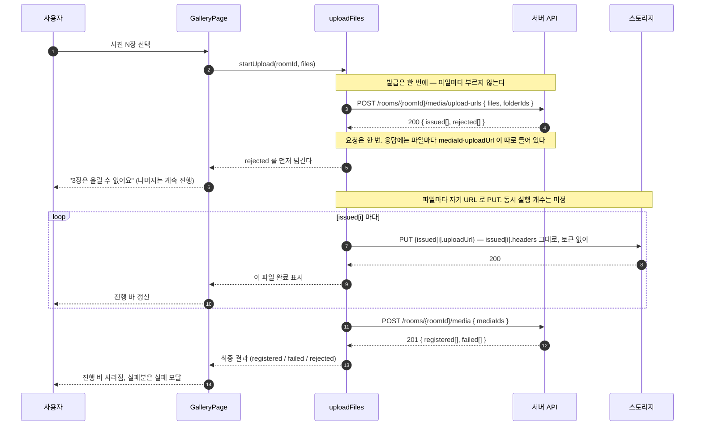
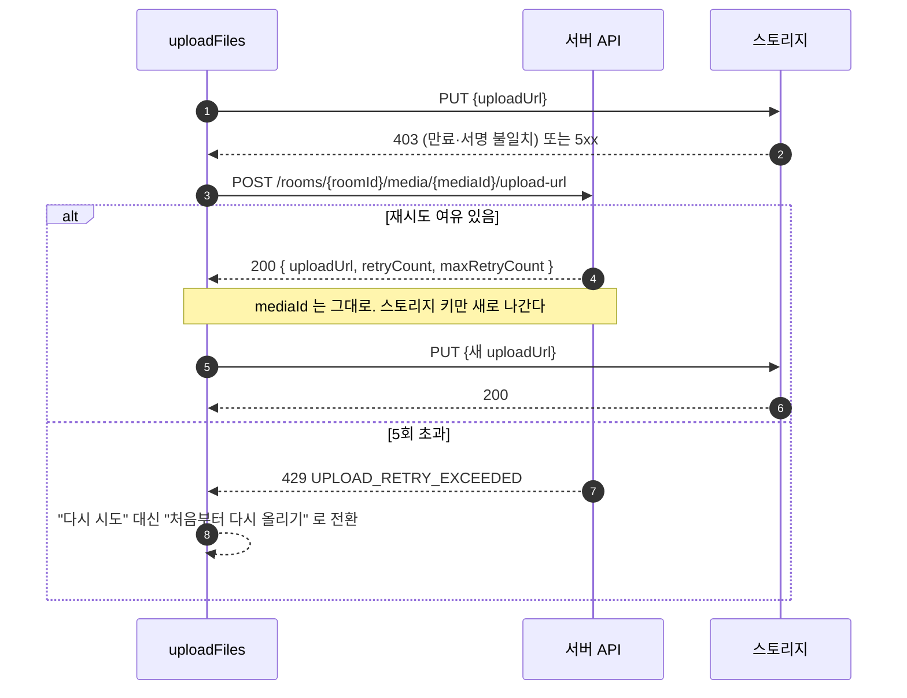

# 업로드 흐름

사용자가 사진을 고른 순간부터 갤러리에 올라가기까지,
프론트가 무엇을 어떤 순서로 부르는지 정리한 문서다.

> 목이 실제로 어떻게 답하는지는 [UPLOAD_MOCK.md](./UPLOAD_MOCK.md) 를 본다.
> 그쪽이 지금 동작하는 계약이고, 이 문서는 그 계약을 쓰는 쪽 이야기다.

관련 이슈: [#75 요청 흐름](https://github.com/woowacourse-teams/2026-sssOK/issues/75) ·
[#72 사진 선택](https://github.com/woowacourse-teams/2026-sssOK/issues/72) ·
[#73 진행 상황 바](https://github.com/woowacourse-teams/2026-sssOK/issues/73) ·
[#74 실패 모달](https://github.com/woowacourse-teams/2026-sssOK/issues/74) ·
[#76 서버 API](https://github.com/woowacourse-teams/2026-sssOK/issues/76)

---

## 전체 흐름



### 이 그림에서 놓치면 안 되는 것

- **발급은 한 번, PUT과 등록은 파일 단위다.** 발급을 파일마다 부르면 `rejected` 로 부분 실패를
  갈라주는 설계가 무의미해지고, 30장이면 요청이 90번 나간다.
- **PUT은 `apiClient` 를 타면 안 된다.** 토큰이 자동으로 붙어 403 이 난다. 생 `fetch` 로 보내고,
  헤더는 발급 응답의 `headers` 를 **그대로** 싣는다.
- **`rejected` 는 즉시 사용자에게 알린다.** 업로드가 끝날 때까지 기다릴 이유가 없다.
  올릴 수 없다는 건 발급 시점에 이미 확정이다.
- **`mediaId` 가 손잡이다.** `storageKey` 는 응답에 없고, 알 필요도 없다.

---

## 실패했을 때 — 재발급

PUT이 403이나 5xx로 깨진 파일은 **처음부터 다시 올리는 게 아니라** 새 URL만 받아 이어서 올린다.



**옛 URL은 무효화되지 않는다.** 서명이 URL에 박혀 있어 취소할 방법이 없다. 대신 서버가
스토리지 키를 갈아끼우므로, 뒤늦게 도착한 옛 PUT은 200을 받되 고아 객체가 될 뿐 새 파일을 덮지 않는다.
그래도 **클라이언트는 옛 요청을 `AbortController` 로 끊는 게 맞다** — 쓸데없이 대역폭을 먹는다.

---

## 파일 하나의 상태

화면이 그려야 하는 건 배치 전체가 아니라 **파일 하나하나의 상태**다.

```
선택됨
  ├─(발급 rejected)──────────────→ 올릴 수 없음   ← 사유를 그대로 보여준다
  └─(발급 issued)─→ 올리는 중
                      ├─(PUT 200)──→ 등록 대기 ─(등록 성공)─→ 완료
                      │                          └─(등록 failed)─→ 실패
                      └─(PUT 실패)─→ 재발급 중 ─┬─(200)→ 올리는 중 (되돌아감)
                                                 └─(429)→ 실패 (재시도 불가)
```

`rejected` 와 `failed` 는 사용자에게 다르게 보여야 한다.

- **`rejected`** — 파일 자체가 조건에 안 맞는다. **다시 눌러도 똑같이 실패한다.** 재시도 버튼을 주면 안 된다.
- **`failed`** — 전송이 어쩌다 깨졌다. **재시도가 의미 있다.**

---

## 에러를 화면에 어떻게 옮길지

| 어디서 | 응답                                        | 화면                                                                                                             |
| ------ | ------------------------------------------- | ---------------------------------------------------------------------------------------------------------------- |
| 발급   | `rejected` `UNSUPPORTED_FILE_TYPE`          | 파일명과 함께 "이미지와 영상만 올릴 수 있어요". 나머지는 그대로 진행                                             |
| 발급   | `rejected` `FILE_SIZE_EXCEEDED`             | "사진은 10MB까지 올릴 수 있어요"                                                                                 |
| 발급   | `403 NOT_ROOM_HOST`                         | 방장만 올릴 수 있는 방. **업로드 버튼 자체를 미리 숨기는 게 낫다** — 방 조회 응답의 `uploadPolicy` 로 알 수 있다 |
| 발급   | `403 NOT_ROOM_MEMBER`                       | 세션이 끊긴 상황. 입장 화면으로 되돌린다                                                                         |
| 발급   | `410 ROOM_EXPIRED` / `ROOM_ALREADY_DELETED` | 만료·삭제 화면으로                                                                                               |
| 발급   | `404 FOLDER_NOT_FOUND`                      | 열어둔 폴더가 지워졌다. 루트로 올릴지 물어본다                                                                   |
| PUT    | `403`                                       | **사용자에게 안 보인다.** 재발급 후 자동 재시도                                                                  |
| PUT    | `5xx` · 네트워크 끊김                       | 마찬가지로 자동 재시도. 한도를 넘으면 그때 실패로 표시                                                           |
| 재발급 | `429 UPLOAD_RETRY_EXCEEDED`                 | "처음부터 다시 올려주세요"                                                                                       |
| 등록   | `failed` `UPLOAD_NOT_COMPLETED`             | 재시도 대상. 재발급부터 다시                                                                                     |
| 등록   | `failed` `UPLOAD_ALREADY_COMPLETED`         | 이미 올라간 것이다. **실패로 보여주면 안 된다** — 성공으로 합친다                                                |

마지막 줄이 걸리기 쉽다. 네트워크가 불안해 등록 요청이 두 번 나가면 두 번째가 이 코드를 받는데,
이걸 실패로 표시하면 사용자는 멀쩡히 올라간 사진을 실패로 본다.

---

## 이미 정해진 것 (#75)

이슈 [#75](https://github.com/woowacourse-teams/2026-sssOK/issues/75) 가 못 박아둔 제약이다.
나중에 갈아엎지 않으려면 처음부터 지켜야 한다.

| 제약                                      | 이유                                                                                                 |
| ----------------------------------------- | ---------------------------------------------------------------------------------------------------- |
| **`XMLHttpRequest` 로 작성한다**          | `fetch` 에는 업로드 진행 이벤트가 없다. 진행 바를 붙일 때 통째로 다시 써야 한다                      |
| **`shared/api/apiClient` 를 쓰지 않는다** | 접두사·토큰을 붙이고 `{ data }` 를 파싱하는데, 스토리지 PUT 은 외부 도메인이고 응답 본문이 비어 있다 |
| **`File` 을 그대로 전송한다**             | `readAsArrayBuffer` 등으로 읽으면 아이폰에서 메모리로 죽는다                                         |
| **스토리지 오류 응답을 파싱하지 않는다**  | R2 오류는 XML 이라 우리 `ApiError` 형식이 아니다                                                     |
| **동시 실행 개수를 제한한다**             | 나머지는 대기했다가 앞선 파일이 끝나면 시작. 숫자는 아직 미정                                        |
| **중단을 지원한다**                       | 중단 요청을 받으면 진행 중인 PUT 이 실제로 취소돼야 한다                                             |

## 아직 정하지 않은 것

아래는 아직 팀에서 합의하지 않은 항목이다.

| #   | 정할 것               | 선택지                                                                                                                                   |
| --- | --------------------- | ---------------------------------------------------------------------------------------------------------------------------------------- |
| 1   | **동시 업로드 개수**  | 전부 병렬 / 3~4개씩 / 순차. 아래 만료 계산을 근거로 정한다                                                                               |
| 2   | **완료 등록 시점**    | ⓐ 전부 끝나고 한 번 (요청 1회, 대신 마지막까지 갤러리에 아무것도 안 뜸) ⓑ 끝난 것끼리 묶어 주기적으로 (한 장씩 반영되지만 요청이 늘어남) |
| 3   | **자동 재시도 횟수**  | 서버 한도는 5회. 클라이언트가 몇 번까지 자동으로 할지, 백오프를 둘지                                                                     |
| 4   | **`.heic` 사전 안내** | 아이폰 기본 포맷이라 가장 많이 걸릴 것이다. 파일 선택 단계에서 미리 걸러 보여줄지                                                        |

### 1번을 정할 때 — 만료가 걸린다

발급 링크는 **전부 같은 순간에** 10분 시계를 건다. 순차로 올리면 뒤쪽 파일은 자기 차례가 오기 전에 만료된다.
서명은 요청이 **시작될 때** 검사하므로, 동시성이 높을수록 마지막 파일이 일찍 출발해 안전하다.

```
5MB × 30장, 모바일 1Mbps (약 40초/장)

동시 1개 → 30번째가 출발하는 시각 ≈ 1,160초   x 600초를 넘겨 만료 → 재발급
동시 3개 → 30번째가 출발하는 시각 ≈   387초   o
```

반대로 너무 높이면 대역폭이 나뉘어 아무것도 안 끝나고, 진행 바가 다 같이 멈춰 있는 모양이 된다.
HTTP/1.1 이면 브라우저가 호스트당 6개로 어차피 막는다. **3~4개가 흔한 절충값이다.**

사진이 100장 단위로 늘면 발급 자체를 20장씩 끊어 부르는 방법도 있다. 링크가 쓰기 직전에 발급돼
만료 여유가 넉넉해지지만, `rejected` 안내가 여러 번 나뉘어 온다.

---

## 목으로 어디까지 확인되나

[UPLOAD_MOCK.md](./UPLOAD_MOCK.md) 의 목이 아래를 그대로 재현한다. 서버 없이도 검증할 수 있다.

- 발급의 `issued` / `rejected` 분리, 순서 보존
- `headers` 를 그대로 안 실었을 때의 403 (값 불일치·헤더 누락)
- 만료 URL 403, 토큰을 잘못 붙였을 때의 403
- 파일명 표식(`__fail__`, `__expired__`)으로 만드는 실패 — **표식은 최초 발급에만 걸려서
  재발급 후 성공하는 흐름까지 따라갈 수 있다**
- 0바이트 업로드가 등록에서 `UPLOAD_NOT_COMPLETED` 로 걸리는 것
- 재발급의 `retryCount` 증가와 429
- 옛 URL로 뒤늦게 PUT해도 새 파일을 덮지 않는 것

반대로 **목으로는 확인이 안 되는 것**은 이렇다.

- **CORS** — 실제 R2 버킷 설정이 없으면 브라우저의 크로스 오리진 PUT이 막힌다. 연동 첫 관문이다.
- **진행률** — 목은 즉시 응답한다. 진행 바의 실제 동작은 실물로 봐야 한다.
- **대용량** — 1GB 단일 PUT이 현실적인지 미확인. multipart가 필요할 수 있다.
- **`PROCESSING → READY`** — 워커도 SSE도 없어서 등록 직후 `PROCESSING` 에 머문다.
  썸네일이 붙는 순간의 화면 갱신은 목으로 못 만든다.
