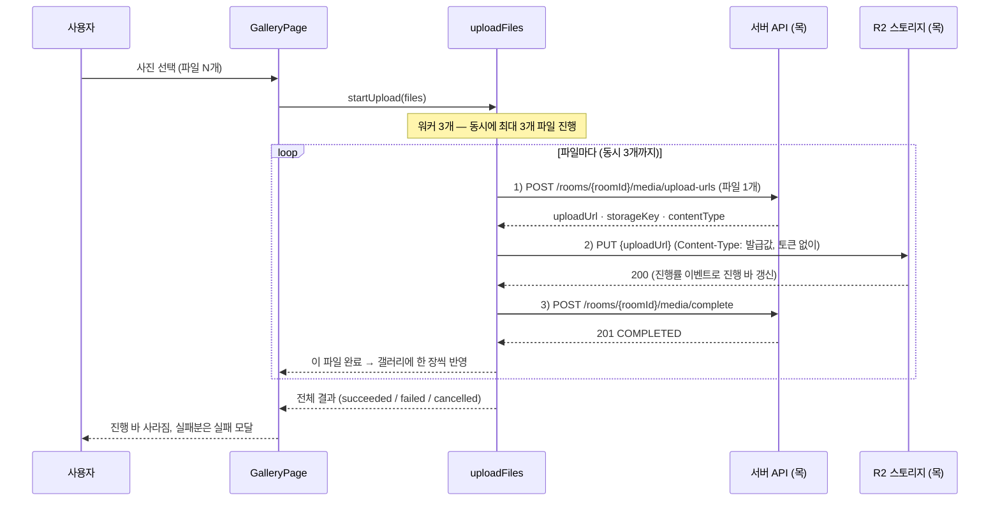

# 업로드 API 목 (MSW)

백엔드 업로드 API 가 나오기 전까지, 프론트가 서버 없이 업로드 기능을 만들 수 있게 하는 목(Mock)이다.

| 무엇이                          | 어디에                                                      |
| ------------------------------- | ----------------------------------------------------------- |
| 목 핸들러 구현                  | `frontend/src/mocks/handlers/upload.ts`                     |
| 동작 검증 테스트                | `frontend/src/mocks/handlers/upload.test.ts`                |
| 제약의 근거 (실제 R2 동작 확인) | [R2_PRESIGNED_UPLOAD.md](../backend/R2_PRESIGNED_UPLOAD.md) |
| 허용 확장자·용량 한도의 출처    | backend `MediaType` enum                                    |

---

## 업로드는 3단계로 이루어진다

파일은 우리 서버를 거치지 않고 **브라우저가 스토리지(R2)에 직접 올린다.**
그래서 "올려도 된다는 허가(presigned URL)를 받고 → 직접 올리고 → 올렸다고 알리는" 3단계가 필요하다.
목은 이 세 요청을 전부 가로챈다.



> 경로 앞에는 공통 접두사 `API_BASE_URL`(`/api/v1`)이 붙는다.
> presigned URL 이란 "이 파일을, 이 타입으로, 이 시간 안에 올려도 된다"는 조건이 서명된 일회용 업로드 주소다.

---

## 1단계 — 업로드 URL 발급

`POST /rooms/{roomId}/media/upload-urls` · `Authorization` 필요

```jsonc
// 요청
{
  "folderId": null,
  "files": [
    { "fileName": "한라산.jpg", "contentType": "image/jpeg", "size": 2097152 },
  ],
}
```

```jsonc
// 201 응답 — 요청한 파일 수만큼, 요청 순서 그대로
{
  "data": [
    {
      "uploadUrl": "https://mock-r2.sssok.dev/sssok-dev/rooms/5031/...",
      "storageKey": "rooms/5031/mock-upload-1.jpg",
      "contentType": "image/jpeg",
    },
  ],
}
```

알아둘 것 3가지:

- **응답 순서 = 요청 순서.** 프론트는 순서로 원본 파일과 짝지운다.
- **응답의 `contentType` 은 서버가 확장자로 다시 정한 값이다.** 요청에 실어 보낸 값은 쓰이지 않는다.
  2단계 PUT 에서 이 값을 그대로 써야 하므로 버리지 말 것.
- **한 파일이라도 검증에 걸리면 아무것도 발급되지 않는다.** (배치 전체 거절)

실패 응답:

| 상황                             | 응답                         |
| -------------------------------- | ---------------------------- |
| 허용하지 않는 확장자 (`heic` 등) | 400 `UNSUPPORTED_MEDIA_TYPE` |
| 사진 10MB 초과 / 영상 1GB 초과   | 413 `FILE_TOO_LARGE`         |
| 토큰 없음                        | 401 `UNAUTHORIZED`           |
| 없는 방 번호                     | 404 `ROOM_NOT_FOUND`         |

허용 확장자: `jpg` `jpeg` `png` `gif` `mp4` `webm` `mov`

---

## 2단계 — R2 로 직접 PUT

`PUT {uploadUrl}` · **`Authorization` 금지** · `Content-Type` 은 발급받은 값 그대로

발급 시점에 Content-Type 이 서명에 들어가기 때문에, 헤더가 다르거나 없으면 서명 검증에서 떨어진다.

```ts
// apiClient 를 쓰지 말고 fetch 로 직접 보낸다
fetch(issued.uploadUrl, {
  method: "PUT",
  headers: { "Content-Type": issued.contentType }, // 발급 응답의 값 그대로
  body: file,
});
```

성공하면 200, 아래는 전부 403 이다:

| 403 이 나는 경우              | 이유                                                             |
| ----------------------------- | ---------------------------------------------------------------- |
| Content-Type 이 발급값과 다름 | 서명에 들어간 값과 불일치                                        |
| Content-Type 헤더 없음        | 서명에 들어간 헤더는 생략도 안 된다                              |
| 만료된 URL (TTL 10분)         | URL 의 `X-Amz-Date` + `X-Amz-Expires` 로 판정                    |
| 발급한 적 없는 storageKey     | 1단계를 거치지 않은 주소                                         |
| `Authorization` 헤더를 실음   | presigned URL 은 서명이 이미 실려 있어 토큰이 있으면 오히려 거절 |

> ⚠️ 마지막 줄이 특히 걸리기 쉽다. R2 로 나가는 PUT 은 토큰을 자동으로 붙이는
> `apiClient` 를 타면 안 되고, 위 예시처럼 `fetch` 로 직접 보내야 한다.

---

## 3단계 — 완료 확정

`POST /rooms/{roomId}/media/complete` · `Authorization` 필요

PUT 이 끝난 파일을 서버에 알린다. **이 호출이 끝나야 파일이 갤러리에 올라간다.**

```jsonc
// 요청
{ "storageKeys": ["rooms/5031/mock-upload-1.jpg"] }
```

| 상황                                    | 응답                                        |
| --------------------------------------- | ------------------------------------------- |
| PUT 까지 끝난 파일                      | 201 + `data[]` (`status: "COMPLETED"`)      |
| PUT 이 끝나지 않은 파일이 하나라도 섞임 | 400 `UPLOAD_NOT_COMPLETED` (배치 전체 거절) |
| 발급한 적 없는 storageKey               | 404 `STORED_FILE_NOT_FOUND`                 |
| 토큰 없음                               | 401 `UNAUTHORIZED`                          |

---

## 실패 화면을 손으로 확인하고 싶을 때

파일 **이름에 표식을 넣으면** 목이 일부러 실패한다 (`UPLOAD_MOCK_MARKERS`).

| 파일 이름에 넣을 표식 | 무슨 일이 생기나                   | 확인할 수 있는 흐름 |
| --------------------- | ---------------------------------- | ------------------- |
| `__fail__`            | 발급은 되고 PUT 이 500 으로 깨진다 | 업로드 실패 모달    |
| `__expired__`         | 이미 만료된 URL 이 발급된다        | 만료 403 처리       |

예: `제주-해변__fail__.jpg` 를 올리면 진행 바가 뜬 뒤 PUT 에서 실패한다.

---

## 백엔드와 합의가 필요한 것들

목이 먼저 정해둔 값이라, 실제 서버 구현과 어긋나면
**목을 고치기 전에 서버 쪽을 맞춰야 하는 건 아닌지 먼저 이야기한다.**

| #   | 목이 정한 것                                    | 왜 그렇게 했나                                                                                                                                                           |
| --- | ----------------------------------------------- | ------------------------------------------------------------------------------------------------------------------------------------------------------------------------ |
| 1   | 발급 요청을 `{ folderId, files }` 객체로 감쌌다 | `StoredFile.beginUpload` 가 발급 시점에 `folderId` 를 받는데, 기존 문서의 배열 형식에는 담을 자리가 없다                                                                 |
| 2   | `contentType` 은 서버가 정한다                  | `MediaType.fromFileName` 이 확장자로 타입을 정하므로 클라이언트 값은 쓰이지 않는다. 요청 필드는 형식만 맞춰 받는다                                                       |
| 4   | 경로는 `/rooms/{roomId}/media/…`                | 이슈 #71 명세를 따랐다. 스파이크 문서의 `/rooms/{code}/files/upload-urls` 와 다르므로 백엔드 구현 시 확인 필요. 완료 확정 경로는 발급 경로에 맞춰 프론트가 정한 이름이다 |
