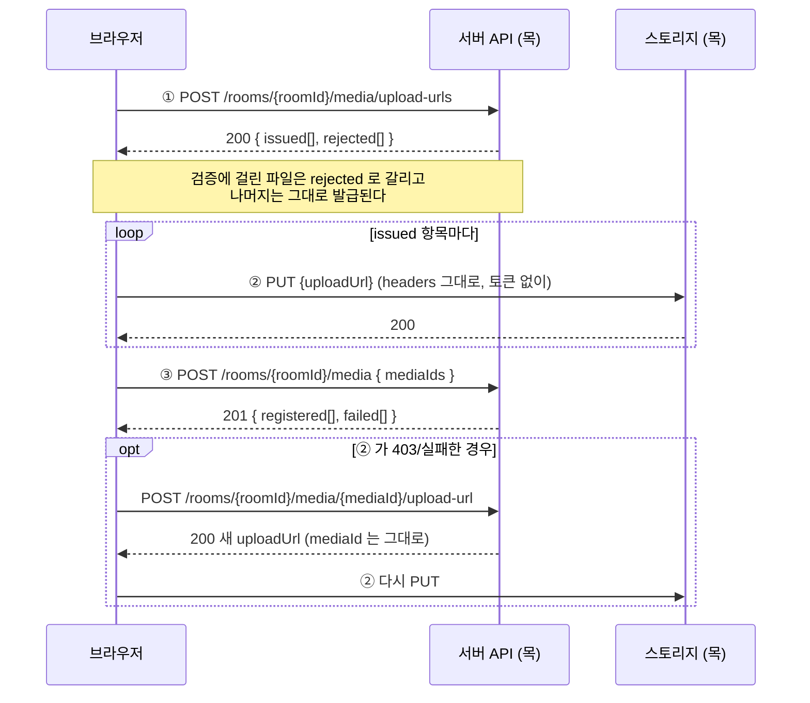

# 업로드 API 목 (MSW)

백엔드 업로드 API 가 나오기 전까지, 프론트가 서버 없이 업로드 기능을 만들 수 있게 하는 목이다.
팀 API 스펙의 발급·완료 등록·재발급 세 엔드포인트를 그대로 따르고, 동작은 전부 핸들러 테스트로 묶어뒀다.

| 무엇이 | 어디에 |
| --- | --- |
| 목 핸들러 구현 | `frontend/src/mocks/handlers/upload.ts` |
| 동작 검증 테스트 | `frontend/src/mocks/handlers/upload.test.ts` |
| 제약의 근거 (실제 R2 동작 확인) | [R2_PRESIGNED_UPLOAD.md](../backend/R2_PRESIGNED_UPLOAD.md) |
| 허용 확장자·용량 한도의 출처 | backend `MediaType` enum |
| 이 목을 쓰는 프론트 업로드 흐름 | [UPLOAD_FLOW.md](./UPLOAD_FLOW.md) |

---

## 업로드는 3단계다

파일은 우리 서버를 거치지 않고 **브라우저가 스토리지에 직접 올린다.**
서버는 그 구간을 보지 못하므로, 앞에서 **허가를 내주고** 뒤에서 **보고를 받는** 대화가 붙는다.



> 경로 앞에는 공통 접두사 `API_BASE_URL`(`/api/v1`)이 붙는다.
> 서명 URL 은 "이 자리에, 이 타입으로, 10분 안에만 올려도 된다"는 조건이 통째로 박힌 일회용 주소다.

### 누가 부를 수 있나

세 API 모두 아래를 위에서부터 차례로 본다. 하나라도 걸리면 거기서 끝난다.

| # | 조건 | 걸리면 |
| --- | --- | --- |
| 1 | 토큰이 실려 있나 | `401 UNAUTHORIZED` |
| 2 | 열려 있는 방인가 | `404 ROOM_NOT_FOUND` · `410 ROOM_EXPIRED` / `ROOM_ALREADY_DELETED` |
| 3 | **입장을 마친 사람인가** (`POST /rooms/{roomId}/members`) | `403 ROOM_MEMBERSHIP_REQUIRED` |
| 4 | **이 방에서 올릴 권한이 있나** — `uploadPolicy=host` 면 방장만 | `403 UPLOAD_NOT_ALLOWED` |
| 5 | (재발급만) 본인이 발급받은 미디어인가 | `403 MEDIA_FORBIDDEN` |

3번과 4번은 다르다. **입장은 했지만 올릴 권한은 없을 수 있다** — 방장만 업로드하도록 설정한
방에 들어온 참여자가 그렇다. 사진을 보기는 하되 올리지는 못한다.

5번은 방 단위가 아니라 파일 단위다. **방장이라도 남이 예약한 업로드는 손대지 못한다.**

---

## ① 업로드 URL 발급

`POST /rooms/{roomId}/media/upload-urls` · `Authorization` 필요

```jsonc
// 요청 — folderIds 는 생략하면 루트
{
  "files": [
    { "fileName": "IMG_0421.jpg", "mimeType": "image/jpeg", "size": 3840219 },
    { "fileName": "note.pdf", "mimeType": "application/pdf", "size": 120000 },
  ],
  "folderIds": [31],
}
```

```jsonc
// 200 — 파일 단위 실패는 요청 전체를 깨지 않는다
{
  "data": {
    "issued": [
      {
        "mediaId": 5012,
        "fileName": "IMG_0421.jpg",
        "uploadUrl": "https://mock-r2.sssok.dev/sssok-dev/rooms/5031/mock-upload-1.jpg?X-Amz-Date=...",
        "method": "PUT",
        "headers": { "Content-Type": "image/jpeg" },
        "expiresIn": 600,
      },
    ],
    "rejected": [
      {
        "fileName": "note.pdf",
        "code": "UNSUPPORTED_MEDIA_TYPE",
        "message": "이미지와 영상만 업로드할 수 있습니다",
      },
    ],
  },
}
```

알아둘 것 넷:

- **`issued` 순서 = 요청 순서.** 프론트는 순서로 원본 `File` 과 짝지운다.
- **`headers` 를 그대로 ② 에 실어야 한다.** 서버가 서명에 넣은 값이라 하나라도 다르면 403 이다.
  직접 `file.type` 으로 추측하면 깨진다.
- **`mediaId` 가 이후 모든 단계의 손잡이다.** 완료 등록(③)도 재발급도 이 번호로 부른다.
- **`rejected` 항목에는 `mediaId` 가 없다.** 재시도는 재발급이 아니라 ① 을 다시 부르는 것이다.

### `rejected` 사유 (요청은 200)

| code | 언제 |
| --- | --- |
| `UNSUPPORTED_MEDIA_TYPE` | 허용 밖 확장자, 확장자 없는 이름 |
| `FILE_TOO_LARGE` | 사진 10MB 초과 / 영상 1GB 초과 |
| `INVALID_PARAM` | 이름이 비었거나 크기가 0 이하 |

허용 확장자: `jpg` `jpeg` `png` `gif` `mp4` `webm` `mov` — backend `MediaType` 과 같다.

### 요청 전체가 실패하는 경우

| HTTP | code | 언제 |
| --- | --- | --- |
| 400 | `INVALID_PARAM` | `files` 누락·빈 배열 |
| 401 | `UNAUTHORIZED` | 토큰 없음 |
| 403 | `ROOM_MEMBERSHIP_REQUIRED` | 입장하지 않은 방 |
| 403 | `UPLOAD_NOT_ALLOWED` | `uploadPolicy=host` 인 방에 방장이 아닌 사람이 요청 |
| 404 | `ROOM_NOT_FOUND` | 없는 방 |
| 404 | `FOLDER_NOT_FOUND` | 모르는 `folderIds` |
| 410 | `ROOM_EXPIRED` / `ROOM_ALREADY_DELETED` | 만료·삭제된 방 |

---

## ② 스토리지로 직접 PUT

`PUT {uploadUrl}` · **`Authorization` 금지** · 발급받은 `headers` 그대로

```ts
// apiClient 를 쓰면 안 된다 — 토큰이 자동으로 붙어 403 이 난다
fetch(issued.uploadUrl, {
  method: issued.method,
  headers: issued.headers,
  body: file,
});
```

성공하면 200. 아래는 전부 403 이다.

| 403 이 나는 경우 | 이유 |
| --- | --- |
| `Content-Type` 이 발급값과 다름 | 서명에 들어간 값과 불일치 |
| `Content-Type` 헤더 없음 | 서명에 든 헤더는 생략도 안 된다 |
| 만료된 URL (TTL 10분) | URL 의 `X-Amz-Date` + `X-Amz-Expires` 로 판정 |
| 발급받은 적 없는 키 | ① 을 거치지 않은 주소 |
| `Authorization` 헤더를 실음 | 서명이 이미 URL 에 있어 토큰이 있으면 오히려 거절 |

> ⚠️ **빈 body 로 PUT 해도 200 이 나온다.** 스토리지는 0바이트 객체를 만들 뿐이고,
> 이건 ③ 에서 `UPLOAD_NOT_COMPLETED` 로 걸러진다. 목도 같게 동작한다.

---

## ③ 완료 등록

`POST /rooms/{roomId}/media` · `Authorization` 필요

PUT 이 끝난 미디어를 방 목록에 노출시킨다. **이 호출이 끝나야 갤러리에 올라간다.**

```jsonc
// 요청
{ "mediaIds": [5012, 5013] }
```

```jsonc
// 201
{
  "data": {
    "registered": [
      {
        "mediaId": 5012,
        "type": "IMAGE",
        "fileName": "IMG_0421.jpg",
        "mimeType": "image/jpeg",
        "size": 3840219,
        "thumbnailUrl": null,
        "originalUrl": null,
        "width": 4032,
        "height": 3024,
        "duration": null,
        "folderIds": [31],
        "uploaderId": 10234,
        "uploaderName": "로지",
        "status": "PROCESSING",
        "uploadedAt": "2026-08-26T05:32:00.000Z",
      },
    ],
    "failed": [
      {
        "mediaId": 5013,
        "code": "UPLOAD_NOT_COMPLETED",
        "message": "업로드가 완료되지 않았습니다. 다시 시도해 주세요",
      },
    ],
  },
}
```

### `failed` 사유 (요청은 201)

| code | 언제 |
| --- | --- |
| `UPLOAD_NOT_COMPLETED` | PUT 을 안 했거나 0바이트로 올라감, PUT 이 500 으로 깨짐 |
| `FILE_TOO_LARGE` | 실제로 올라온 바이트가 한도를 넘음 |
| `MEDIA_NOT_FOUND` | 발급받은 적 없는 `mediaId`, 다른 방의 미디어 |
| `UPLOAD_ALREADY_COMPLETED` | 이미 등록이 끝남 |

### 요청 전체가 실패하는 경우

| HTTP | code | 언제 |
| --- | --- | --- |
| 400 | `INVALID_PARAM` | `mediaIds` 누락·빈 배열 |
| 401 / 403 / 404 / 410 | ① 과 같음 | 방·권한 |
| 403 | `MEDIA_FORBIDDEN` | 남이 발급받은 `mediaId` 가 하나라도 섞임 |

---

## 재발급 — 만료·실패한 업로드 다시 올리기

`POST /rooms/{roomId}/media/{mediaId}/upload-url` · **업로더 본인만** (방장도 남의 것은 불가)

```jsonc
// 요청 — 바디 없이 불러도 된다. 재압축해서 크기가 바뀐 경우에만 size 를 싣는다
{ "size": 3512004 }
```

```jsonc
// 200
{
  "data": {
    "mediaId": 5013,
    "fileName": "VID_0032.mp4",
    "uploadUrl": "https://mock-r2.sssok.dev/sssok-dev/rooms/5031/mock-upload-4.mp4?...",
    "method": "PUT",
    "headers": { "Content-Type": "video/mp4" },
    "expiresIn": 600,
    "retryCount": 2,
    "maxRetryCount": 5,
  },
}
```

| HTTP | code | 언제 |
| --- | --- | --- |
| 400 | `INVALID_PARAM` | `size` 가 0 이하 |
| 403 | `MEDIA_FORBIDDEN` | 남이 발급받은 미디어 |
| 404 | `MEDIA_NOT_FOUND` | 없는 `mediaId` |
| 409 | `UPLOAD_ALREADY_COMPLETED` | 이미 등록이 끝난 미디어 |
| 413 | `FILE_TOO_LARGE` | 바뀐 크기가 한도 초과 |
| 429 | `UPLOAD_RETRY_EXCEEDED` | 5회 초과 — "다시 시도" 대신 "처음부터 다시 올리기" 안내 |

**`mediaId` 는 유지되고 스토리지 키만 새로 나간다.** 그래서 옛 URL 로 뒤늦게 도착한 PUT 이
새로 올린 파일을 덮어쓰지 못한다 (그 요청은 200 을 받지만 고아 객체가 될 뿐이다).

---

## 실패 화면을 손으로 확인하고 싶을 때

파일 **이름에 표식을 넣으면** 목이 일부러 실패한다 (`UPLOAD_MOCK_MARKERS`).

| 표식 | 무슨 일이 생기나 | 확인할 수 있는 흐름 |
| --- | --- | --- |
| `__fail__` | 발급은 되고 PUT 이 500 으로 깨진다 | 업로드 실패 UI |
| `__expired__` | 이미 만료된 URL 이 발급된다 | 만료 403 처리 |

예: `제주-해변__fail__.jpg`

**표식은 최초 발급에만 걸린다.** 재발급받은 URL 은 멀쩡해서, "깨진 뒤 다시 올려 성공하는"
재시도 흐름까지 그대로 따라갈 수 있다.

### 손으로 3단계 돌려보기

업로드 UI 가 아직 없어서 지금은 콘솔에서 직접 부른다. `pnpm start` 후 `localhost:3000` 콘솔에서:

```js
const BASE = "/api/v1";
const ROOM_ID = 5031; // MOCK_ROOM_CODES.active 방
const AUTH = { "Content-Type": "application/json", Authorization: "Bearer mock-token-10234" };

// 0) 입장 — 입장을 마쳐야 업로드를 부를 수 있다
await fetch(`${BASE}/rooms/${ROOM_ID}/members`, { method: "POST", headers: AUTH });

// 1) 파일 고르기
const input = document.createElement("input");
input.type = "file";
input.multiple = true;
input.click();
await new Promise((r) => input.addEventListener("change", r, { once: true }));
const files = [...input.files];

// 2) 발급
const { data } = await fetch(`${BASE}/rooms/${ROOM_ID}/media/upload-urls`, {
  method: "POST",
  headers: AUTH,
  body: JSON.stringify({
    files: files.map((f) => ({ fileName: f.name, mimeType: f.type, size: f.size })),
  }),
}).then((r) => r.json());
console.log("issued", data.issued, "rejected", data.rejected);

// 3) PUT
for (const [i, issued] of data.issued.entries()) {
  const res = await fetch(issued.uploadUrl, {
    method: issued.method,
    headers: issued.headers,
    body: files[i],
  });
  console.log(issued.fileName, res.status);
}

// 4) 완료 등록
const done = await fetch(`${BASE}/rooms/${ROOM_ID}/media`, {
  method: "POST",
  headers: AUTH,
  body: JSON.stringify({ mediaIds: data.issued.map((x) => x.mediaId) }),
}).then((r) => r.json());
console.log(done);
```

`.heic` 를 섞으면 `rejected` 로 갈리고, 10MB 넘는 원본은 `FILE_TOO_LARGE` 로 갈린다.

### 목이 아는 값들

| | |
| --- | --- |
| 방 (업로드 가능) | `7K93QX2S`(5031), `QRST6789`(5032) |
| 방 (방장만 업로드) | `HSTNLY23`(5035) — `UPLOAD_NOT_ALLOWED` 확인용 |
| 방 (만료/삭제) | `EXPRED77`(5033) / `DELETED7`(5034) |
| 방장 회원 번호 | `10234` — 토큰은 `Bearer mock-token-10234` |
| 폴더 | `31`, `32` — 그 밖의 번호는 `FOLDER_NOT_FOUND` |

> 목 토큰은 `mock-token-{userId}` 형태여야 한다. 업로더를 가려야 `MEDIA_FORBIDDEN` 을
> 판정할 수 있어서, 다른 모양의 토큰은 401 로 막는다.

---

## 목이 스펙에서 조정한 것

스펙 문서와 다르게 구현한 부분이다. **목을 고치기 전에 스펙 쪽이 맞는지 먼저 이야기한다.**

| # | 조정 | 왜 |
| --- | --- | --- |
| 1 | 응답을 `{ "data": ... }` 로 한 겹 감쌌다 | backend `ApiResponse<T>` 가 모든 응답을 그렇게 내보내고, `apiClient` 는 `data` 가 없으면 `INVALID_RESPONSE` 를 던진다 |
| 2 | `413 FILE_TOO_LARGE` 를 실패 표에서 뺐다 | 같은 조건이 `rejected[]` 에도 있어 충돌한다. 파일 단위 사유는 전부 `rejected` 로 모았다 |
| 3 | `408 UPLOAD_INTERRUPTED` 를 뺐다 | PUT 은 브라우저↔스토리지 구간이라 우리 서버가 관측할 수 없다. 클라이언트가 자체 처리할 상태다 |
| 4 | 재발급 때 스토리지 키를 새로 만든다 | presigned URL 은 **무효화할 수 없다.** 같은 키를 재사용하면 뒤늦게 도착한 옛 PUT 이 새 파일을 덮는다 |
| 5 | `③` 의 `failed` 에 `UPLOAD_ALREADY_COMPLETED` 를 추가했다 | 네트워크 재시도로 같은 `mediaIds` 가 두 번 올 수 있는데 스펙에 해당 코드가 없다 |
| 6 | 공통 에러(401/403/404/410)를 세 API 모두에 넣었다 | 스펙 실패 표에 빠져 있지만 `GlobalExceptionHandler` 에 이미 있는 코드들이다 |
| 7 | `ROOM_MEMBERSHIP_REQUIRED` 를 강제한다 | 스펙 실패 표엔 없지만 개요의 "권한: 참여자" 를 그대로 지킨 것이다 |

### 백엔드 코드와 맞춰야 하는 것

목은 **스펙 쪽 이름을 따랐다.** 실제 구현 전에 어느 쪽으로 갈지 정해야 한다.

| 스펙 (목이 따름) | 현재 backend 코드 |
| --- | --- |
| `uploadPermission` = `HOST` | `uploadPolicy` = `"host"` (소문자) — 목은 backend 표기를 썼다 |
| `folderIds: Array<Long>` | `StoredFile.beginUpload(..., Long folderId, ...)` — 폴더 **하나** |
| `status`: RESERVED / PROCESSING / READY | `UploadStatus`: PENDING / UPLOADING / COMPLETED / FAILED |
| RESERVED 에서도 재시도 허용 | `UploadStatus.isRetryable()` → FAILED 일 때만 |
| `mimeType` 필수 | `MediaType.fromFileName` — 확장자로 결정, 클라이언트 값은 안 씀 |
| `UPLOAD_NOT_ALLOWED` | `NOT_ROOM_HOST` 가 이미 있음 |

`expiresIn`(상대 초)보다 **`expiresAt`(절대 시각)** 이 안전하다는 것도 함께 이야기할 만하다.
응답을 받은 시점 기준으로 세면 네트워크 지연이 그대로 오차가 된다.

---

## 목이 흉내 내지 못하는 것

- **CORS** — 목은 같은 프로세스에서 응답한다. 실제로는 R2 버킷 CORS 설정이 없으면
  브라우저의 크로스 오리진 PUT 이 막힌다. **연동 시점의 첫 관문이다.**
- **업로드 진행률** — 목은 즉시 응답한다. 진행 바를 만들려면 `XMLHttpRequest.upload.onprogress` 가 필요하다.
- **`PROCESSING → READY` 전이** — 워커도 SSE 도 없어서 등록 직후 `PROCESSING` 에 머문다.
  `thumbnailUrl` / `originalUrl` 은 계속 `null` 이다.
- **미디어 목록 조회** — 아직 핸들러가 없다. 등록한 미디어를 다시 꺼내 볼 창구가 없다.
- **파일 내용** — 목은 바이트를 세기만 하고 버린다. 실제 치수를 모르므로
  `width`/`height`/`duration` 은 타입별 고정 더미값이다.
- **대용량 / multipart** — 1GB 단일 PUT 이 현실적인지는 실물로 확인해야 한다.
